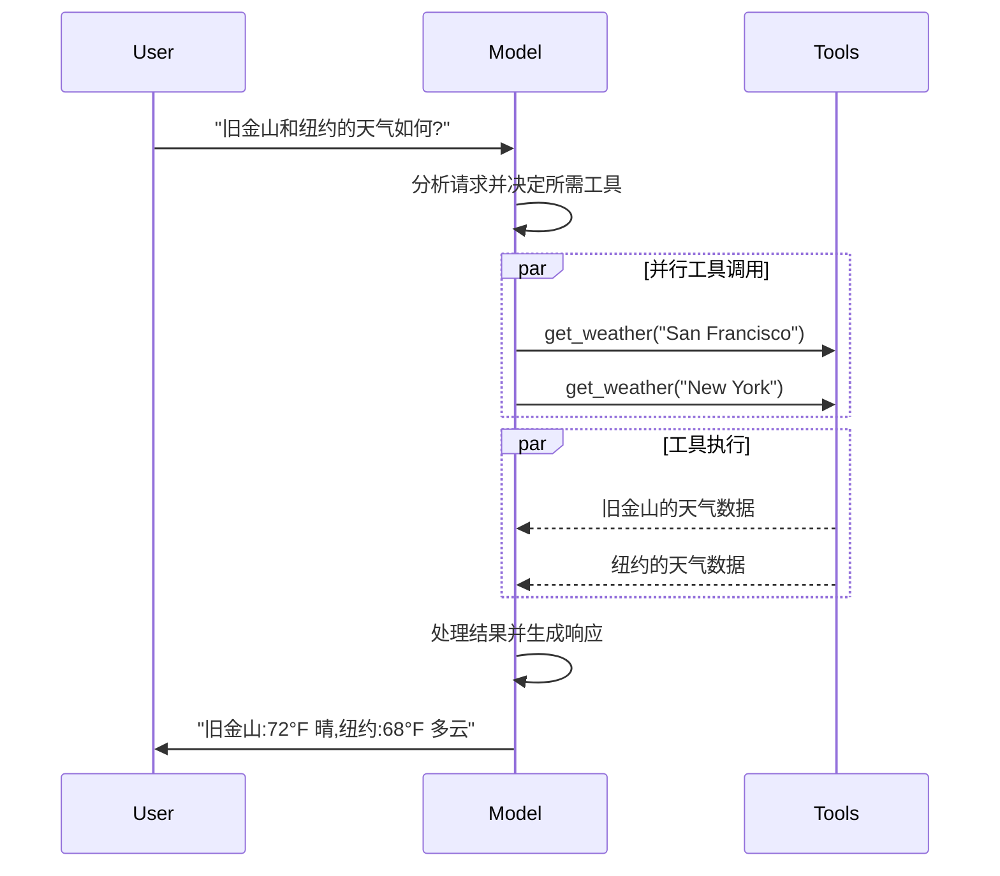

# Models(模型)

> 原文:[Models](https://docs.langchain.com/oss/python/langchain/models)

[LLM](https://en.wikipedia.org/wiki/Large_language_model) 是强大的 AI 工具,能够像人类一样理解和生成文本。它们足够通用,无需为每个任务做专门训练,即可撰写内容、翻译语言、做摘要和回答问题。

除文本生成之外,许多模型还支持:

- [工具调用(Tool calling)](#工具调用tool-calling):调用外部工具(如数据库查询或 API 调用),并在响应中使用其结果。
- [结构化输出(Structured output)](#结构化输出structured-output):模型的响应被约束为遵循某种预定义格式。
- [多模态(Multimodality)](#多模态multimodal):处理和返回文本以外的数据,如图像、音频和视频。
- [推理(Reasoning)](#推理reasoning):模型执行多步推理以得出结论。

模型是 [Agent](https://docs.langchain.com/oss/python/langchain/agents) 的推理引擎。它们驱动 Agent 的决策过程:决定调用哪些工具、如何解读结果、何时给出最终回答。

你所选模型的质量与能力,直接决定了 Agent 的可靠性与性能基线。不同模型各有所长——有些更擅长遵循复杂指令,有些更擅长结构化推理,还有些支持更大的上下文窗口以处理更多信息。

LangChain 的标准模型接口让你可以接入众多提供商的集成,从而方便地试验并切换模型,找到最适合你使用场景的那一个。

关于特定提供商的集成信息与能力,请参见该提供商的[对话模型页面](https://docs.langchain.com/oss/python/integrations/chat)。

> **提示**
>
> [LangSmith](https://docs.langchain.com/langsmith/observability) 会追踪每次模型调用,让你可以比较提供商、检查工具路由并调试失败。可参考[追踪快速入门](https://docs.langchain.com/langsmith/trace-with-langchain)完成配置。我们还建议同时配置 [LangSmith Engine](https://docs.langchain.com/langsmith/engine),它可以监控你的追踪数据、检测问题并提出修复建议。

## 基本用法

模型有两种使用方式:

1. **配合 Agent 使用** —— 创建 [Agent](https://docs.langchain.com/oss/python/langchain/agents#model) 时可以动态指定模型。
2. **独立使用** —— 可以直接调用模型(在 Agent 循环之外),用于文本生成、分类或抽取等任务,无需 Agent 框架。

同一个模型接口在两种场景下都能工作,这让你可以先从简单起步,按需扩展到更复杂的基于 Agent 的工作流。

### 初始化模型

在 LangChain 中上手独立模型最简单的方式,是使用 [`init_chat_model`](https://reference.langchain.com/python/langchain/chat_models/base/init_chat_model) 从你选择的对话模型提供商初始化一个模型(示例如下):

**OpenAI**(👉 参见 [OpenAI 对话模型集成文档](https://docs.langchain.com/oss/python/integrations/chat/openai/))

```bash
pip install -U "langchain[openai]"   # 或:uv add "langchain[openai]"
```

```python
# 方式一:init_chat_model
import os
from langchain.chat_models import init_chat_model

os.environ["OPENAI_API_KEY"] = "sk-..."

model = init_chat_model("gpt-5.5")
```

```python
# 方式二:直接使用模型类
import os
from langchain_openai import ChatOpenAI

os.environ["OPENAI_API_KEY"] = "sk-..."

model = ChatOpenAI(model="gpt-5.5")
```

**Anthropic**(👉 参见 [Anthropic 对话模型集成文档](https://docs.langchain.com/oss/python/integrations/chat/anthropic/))

```bash
pip install -U "langchain[anthropic]"   # 或:uv add "langchain[anthropic]"
```

```python
import os
from langchain.chat_models import init_chat_model

os.environ["ANTHROPIC_API_KEY"] = "sk-..."

model = init_chat_model("claude-sonnet-4-6")
```

**Azure**(👉 参见 [Azure 对话模型集成文档](https://docs.langchain.com/oss/python/integrations/chat/azure_chat_openai/))

```bash
pip install -U "langchain[openai]"   # 或:uv add "langchain[openai]"
```

```python
import os
from langchain.chat_models import init_chat_model

os.environ["AZURE_OPENAI_API_KEY"] = "..."
os.environ["AZURE_OPENAI_ENDPOINT"] = "..."
os.environ["OPENAI_API_VERSION"] = "2025-03-01-preview"

model = init_chat_model(
    "azure_openai:gpt-5.5",
    azure_deployment=os.environ["AZURE_OPENAI_DEPLOYMENT_NAME"],
)
```

**Google Gemini**(👉 参见 [Google GenAI 对话模型集成文档](https://docs.langchain.com/oss/python/integrations/chat/google_generative_ai/))

```bash
pip install -U "langchain[google-genai]"   # 或:uv add "langchain[google-genai]"
```

```python
import os
from langchain.chat_models import init_chat_model

os.environ["GOOGLE_API_KEY"] = "..."

model = init_chat_model("google_genai:gemini-3.7-flash")
```

**AWS Bedrock**(👉 参见 [AWS Bedrock 对话模型集成文档](https://docs.langchain.com/oss/python/integrations/chat/bedrock/))

```bash
pip install -U "langchain[aws]"   # 或:uv add "langchain[aws]"
```

```python
from langchain.chat_models import init_chat_model

# 按照以下步骤配置你的凭证:
# https://docs.aws.amazon.com/bedrock/latest/userguide/getting-started.html

model = init_chat_model(
    "us.anthropic.claude-sonnet-4-6",
    model_provider="bedrock_converse",
)
```

**HuggingFace**(👉 参见 [HuggingFace 对话模型集成文档](https://docs.langchain.com/oss/python/integrations/chat/huggingface/))

```bash
pip install -U "langchain[huggingface]"   # 或:uv add "langchain[huggingface]"
```

```python
import os
from langchain.chat_models import init_chat_model

os.environ["HUGGINGFACEHUB_API_TOKEN"] = "hf_..."

model = init_chat_model(
    "microsoft/Phi-3-mini-4k-instruct",
    model_provider="huggingface",
    temperature=0.7,
    max_tokens=1024,
)
```

**OpenRouter**(👉 参见 [OpenRouter 对话模型集成文档](https://docs.langchain.com/oss/python/integrations/chat/openrouter/))

```bash
pip install -U "langchain-openrouter"   # 或:uv add "langchain-openrouter"
```

```python
import os
from langchain.chat_models import init_chat_model

os.environ["OPENROUTER_API_KEY"] = "sk-..."

model = init_chat_model(
    "auto",
    model_provider="openrouter",
)
```

初始化之后即可调用:

```python
response = model.invoke("Why do parrots talk?")
```

更多细节(包括如何传入模型[参数](#参数)),参见 [`init_chat_model`](https://reference.langchain.com/python/langchain/chat_models/base/init_chat_model)。

### 支持的提供商与模型

LangChain 通过专门的集成包支持所有主流模型提供商。每个提供商包实现同一个标准接口,因此你可以在不重写应用逻辑的情况下切换提供商。新的模型名无需更新 LangChain 即可使用——因为提供商包会把模型名直接传给提供商的 API。

可浏览[完整的提供商列表](https://docs.langchain.com/oss/python/integrations/providers/overview),或参见 [Providers and models](https://docs.langchain.com/oss/python/concepts/providers-and-models) 了解提供商、包和模型名在 LangChain 中如何协同工作的概念性介绍。

### 关键方法

- **Invoke**:模型以消息为输入,在生成完整响应后输出消息。
- **Stream**:调用模型,但以流式方式实时输出正在生成的内容。
- **Batch**:将多个请求以批次(batch)方式发送给模型,以便更高效地处理。

> **说明**
>
> 除对话模型外,LangChain 还支持其他相关技术,如嵌入模型(embedding models)和向量存储(vector stores)。详情参见[集成页面](https://docs.langchain.com/oss/python/integrations/providers/overview)。

## 参数

对话模型接受一组可用于配置其行为的参数。不同模型和提供商支持的完整参数集合各不相同,但标准参数包括:

| 参数 | 类型 | 说明 |
|------|------|------|
| `model` | string(必填) | 你要使用的具体模型的名称或标识符。也可以用 `'{model_provider}:{model}'` 格式在一个参数中同时指定模型和提供商,例如 `'openai:o1'`。 |
| `api_key` | string | 向模型提供商认证所需的密钥。通常在注册获取模型访问权限时颁发。一般通过设置[环境变量](https://en.wikipedia.org/wiki/Environment_variable)来访问。 |
| `temperature` | number | 控制模型输出的随机性。数值越高,响应越有创造性;数值越低,响应越确定。 |
| `max_tokens` | number | 限制响应中的 [token](https://platform.openai.com/tokenizer) 总数,实质上控制输出的长度上限。 |
| `timeout` | number | 等待模型响应的最长时间(秒),超时后取消请求。 |
| `max_retries` | number(默认 6) | 请求因网络超时、速率限制等问题失败时,系统重发的最大次数。重试采用带抖动的指数退避(exponential backoff with jitter)。网络错误、速率限制(429)和服务器错误(5xx)会自动重试;客户端错误如 401(未授权)或 404 不会重试。对于运行在不可靠网络上的长时间 [Agent](https://docs.langchain.com/oss/python/deepagents/overview) 任务,可考虑将其提高到 10–15。 |

使用 [`init_chat_model`](https://reference.langchain.com/python/langchain/chat_models/base/init_chat_model) 时,这些参数以行内 [`**kwargs`](https://www.w3schools.com/python/python_args_kwargs.asp) 形式传入:

```python
model = init_chat_model(
    "claude-sonnet-4-6",
    # 传给模型的 kwargs:
    temperature=0.7,
    timeout=30,
    max_tokens=1000,
    max_retries=6,  # 默认值;网络不可靠时可加大
)
```

### 连接韧性(Connection resilience)

LangChain 对话模型会自动以指数退避重试失败的 API 请求。默认情况下,模型对网络错误、速率限制(429)和服务器错误(5xx)最多重试 **6 次**。客户端错误如 401(未授权)或 404 不会重试。

你可以在创建模型时调整 `max_retries` 和 `timeout`,然后把该实例传给 `create_agent`、`create_deep_agent`,或独立调用:

```python
from langchain.chat_models import init_chat_model

model = init_chat_model(
    "google_genai:gemini-3.6-flash",
    max_retries=10,  # 网络不可靠时可加大(默认:6)
    timeout=120,  # 单位:秒;连接慢时可加大
)
```

> **提示**
>
> 对于运行在不可靠网络上的长时间 Agent 图,可考虑更高的 `max_retries`(例如 10–15),并使用 [checkpointer](https://docs.langchain.com/oss/python/langgraph/persistence),以便在故障时保留进度。

> **说明**
>
> 每个对话模型集成可能还有其他用于控制提供商特有功能的参数。例如 [`ChatOpenAI`](https://reference.langchain.com/python/langchain-openai/chat_models/base/ChatOpenAI) 有 `use_responses_api`,用于决定使用 OpenAI 的 Responses API 还是 Completions API。要查找某个对话模型支持的全部参数,请前往[对话模型集成](https://docs.langchain.com/oss/python/integrations/chat)页面。

---

## 调用(Invocation)

对话模型必须被调用才能产生输出。有三种主要的调用方式,分别适用于不同的使用场景。

### Invoke

调用模型最直接的方式是使用 [`invoke()`](https://reference.langchain.com/python/langchain-core/language_models/chat_models/BaseChatModel/invoke),传入单条消息或消息列表。

```python
response = model.invoke("Why do parrots have colorful feathers?")
print(response)
```

可以向对话模型提供一个消息列表来表示对话历史。每条消息都有一个角色(role),模型用它来标识对话中消息的发送者。

关于角色、类型和内容的更多细节,请参见 [messages](https://docs.langchain.com/oss/python/langchain/messages) 指南。

```python
# 字典格式
conversation = [
    {"role": "system", "content": "You are a helpful assistant that translates English to French."},
    {"role": "user", "content": "Translate: I love programming."},
    {"role": "assistant", "content": "J'adore la programmation."},
    {"role": "user", "content": "Translate: I love building applications."}
]

response = model.invoke(conversation)
print(response)  # AIMessage("J'adore créer des applications.")
```

```python
# 消息对象格式
from langchain.messages import HumanMessage, AIMessage, SystemMessage

conversation = [
    SystemMessage("You are a helpful assistant that translates English to French."),
    HumanMessage("Translate: I love programming."),
    AIMessage("J'adore la programmation."),
    HumanMessage("Translate: I love building applications.")
]

response = model.invoke(conversation)
print(response)  # AIMessage("J'adore créer des applications.")
```

> **说明**
>
> 如果你的调用返回类型是字符串,请确认你使用的是对话模型(chat model)而不是 LLM。旧式的文本补全 LLM 会直接返回字符串。LangChain 的对话模型名称都以 "Chat" 为前缀,例如 [`ChatOpenAI`](https://reference.langchain.com/python/langchain-openai/chat_models/base/ChatOpenAI)。

### Stream

大多数模型都能在生成过程中流式输出内容。通过渐进式显示输出,流式输出显著提升了用户体验,尤其是对较长的响应。

调用 [`stream()`](https://reference.langchain.com/python/langchain-core/language_models/chat_models/BaseChatModel/stream) 会返回一个迭代器(iterator),逐个产出(output chunk)生成的输出块。你可以用循环实时处理每个块:

```python
# 基本文本流式输出
for chunk in model.stream("Why do parrots have colorful feathers?"):
    print(chunk.text, end="|", flush=True)
```

```python
# 流式输出工具调用、推理及其他内容
for chunk in model.stream("What color is the sky?"):
    for block in chunk.content_blocks:
        if block["type"] == "reasoning" and (reasoning := block.get("reasoning")):
            print(f"Reasoning: {reasoning}")
        elif block["type"] == "tool_call_chunk":
            print(f"Tool call chunk: {block}")
        elif block["type"] == "text":
            print(block["text"])
        else:
            ...
```

与在模型生成完完整响应后返回单个 [`AIMessage`](https://reference.langchain.com/python/langchain-core/messages/ai/AIMessage) 的 [`invoke()`](#invoke) 不同,`stream()` 返回多个 [`AIMessageChunk`](https://reference.langchain.com/python/langchain-core/messages/ai/AIMessageChunk) 对象,每个对象包含一部分输出文本。重要的是,流中的每个块都被设计为可以通过求和(summation)聚合成完整消息:

```python
full = None  # None | AIMessageChunk
for chunk in model.stream("What color is the sky?"):
    full = chunk if full is None else full + chunk
    print(full.text)

# The
# The sky
# The sky is
# The sky is typically
# The sky is typically blue
# ...

print(full.content_blocks)
# [{"type": "text", "text": "The sky is typically blue..."}]
```

聚合得到的消息可以像 [`invoke()`](#invoke) 生成的消息一样对待——例如,可以汇总进消息历史,作为对话上下文传回模型。

> **警告**
>
> 只有当程序中的所有步骤都知道如何处理块流(stream of chunks)时,流式输出才有效。例如,一个不支持流式的应用,是那种必须把整个输出存入内存后才能处理的应用。

#### 进阶流式主题

**流式事件(Streaming events)**

LangChain 对话模型还可以使用 `astream_events()` 流式输出语义事件。这简化了基于事件类型和其他元数据的过滤,并会在后台聚合完整消息。示例如下:

```python
async for event in model.astream_events("Hello"):

    if event["event"] == "on_chat_model_start":
        print(f"Input: {event['data']['input']}")

    elif event["event"] == "on_chat_model_stream":
        print(f"Token: {event['data']['chunk'].text}")

    elif event["event"] == "on_chat_model_end":
        print(f"Full message: {event['data']['output'].text}")

    else:
        pass
```

```text
Input: Hello
Token: Hi
Token:  there
Token: !
Token:  How
Token:  can
Token:  I
...
Full message: Hi there! How can I help today?
```

> **提示**:事件类型及其他细节参见 [`astream_events()`](https://reference.langchain.com/python/langchain_core/language_models/#langchain_core.language_models.chat_models.BaseChatModel.astream_events) 参考。

**"自动流式"(Auto-streaming)对话模型**

LangChain 在某些情况下会自动启用流式模式,即使你没有显式调用流式方法,也简化了从对话模型获取流式输出的过程。当你使用非流式的 invoke 方法、但又希望对整个应用(包括对话模型的中间结果)进行流式处理时,这尤其有用。

例如,在 [LangGraph Agent](https://docs.langchain.com/oss/python/langchain/agents) 中,你可以在节点内调用 `model.invoke()`,但如果运行在流式模式下,LangChain 会自动委托给流式处理。

*工作原理*:当你 `invoke()` 一个对话模型时,如果 LangChain 检测到你正在尝试对整个应用进行流式处理,它会自动切换到内部流式模式。对使用 invoke 的代码来说,调用结果是相同的;但在对话模型被流式处理期间,LangChain 会负责触发 LangChain 回调系统中的 [`on_llm_new_token`](https://reference.langchain.com/python/langchain-core/callbacks/base/AsyncCallbackHandler/on_llm_new_token) 事件。回调事件让 LangGraph 的 `stream()` 和 `astream_events()` 能够实时呈现对话模型的输出。

### Batch

把一批独立的请求批量发给模型,可以显著提升性能并降低成本,因为处理可以并行进行:

```python
responses = model.batch([
    "Why do parrots have colorful feathers?",
    "How do airplanes fly?",
    "What is quantum computing?"
])
for response in responses:
    print(response)
```

> **注意**
>
> 本节描述的是对话模型方法 [`batch()`](https://reference.langchain.com/python/langchain_core/language_models/#langchain_core.language_models.chat_models.BaseChatModel.batch),它在客户端并行化模型调用。它与推理提供商支持的批量 API(如 [OpenAI](https://platform.openai.com/docs/guides/batch) 或 [Anthropic](https://platform.claude.com/docs/en/build-with-claude/batch-processing#message-batches-api) 的 batch API)**不同**。

默认情况下,`batch()` 只会等整个批次完成后返回最终输出。如果你想在每个输入生成完成时就立刻拿到它的输出,可以使用 [`batch_as_completed()`](https://reference.langchain.com/python/langchain_core/language_models/#langchain_core.language_models.chat_models.BaseChatModel.batch_as_completed) 流式获取结果:

```python
for response in model.batch_as_completed([
    "Why do parrots have colorful feathers?",
    "How do airplanes fly?",
    "What is quantum computing?"
]):
    print(response)
```

> **注意**:使用 `batch_as_completed()` 时,结果可能乱序到达。每个结果都带有输入索引(input index),用于在需要时还原原始顺序。

> **提示**:使用 `batch()` 或 `batch_as_completed()` 处理大量输入时,你可能想控制最大并行调用数。这可以通过在 [`RunnableConfig`](https://reference.langchain.com/python/langchain-core/runnables/config/RunnableConfig) 字典中设置 `max_concurrency` 属性实现:
>
> ```python
> model.batch(
>     list_of_inputs,
>     config={
>         'max_concurrency': 5,  # 限制为 5 个并行调用
>     }
> )
> ```
>
> 支持的全部属性参见 [`RunnableConfig`](https://reference.langchain.com/python/langchain-core/runnables/config/RunnableConfig) 参考。

关于批处理的更多细节,参见[参考文档](https://reference.langchain.com/python/langchain_core/language_models/#langchain_core.language_models.chat_models.BaseChatModel.batch)。

---

## 工具调用(Tool calling)

模型可以请求调用执行特定任务的工具,例如从数据库获取数据、搜索网页或运行代码。工具由两部分组成:

1. 一个 schema(schema),包括工具名称、描述和/或参数定义(通常是 JSON schema);
2. 一个要执行的函数或协程(coroutine)。

> **注意**:你可能会听到"函数调用(function calling)"这个术语。它与"工具调用(tool calling)"是同义的。

以下是用户与模型之间基本的工具调用流程:



要让你定义的工具能被模型使用,必须通过 [`bind_tools`](https://reference.langchain.com/python/langchain-core/language_models/chat_models/BaseChatModel/bind_tools) 绑定它们。在后续调用中,模型可以按需选择调用任意已绑定的工具。

部分模型提供商提供内置工具(built-in tools,即在服务器端执行的工具,如网页搜索和代码解释器),可以通过模型或调用参数启用(例如 [`ChatOpenAI`](https://docs.langchain.com/oss/python/integrations/chat/openai)、[`ChatAnthropic`](https://docs.langchain.com/oss/python/integrations/chat/anthropic))。详情参见各自的[提供商参考](https://docs.langchain.com/oss/python/integrations/providers/overview)。

> **提示**:详情以及创建工具的其他方式,参见[工具指南](https://docs.langchain.com/oss/python/langchain/tools)。

```python
from langchain.tools import tool

@tool
def get_weather(location: str) -> str:
    """获取某地的天气。"""
    return f"It's sunny in {location}."


model_with_tools = model.bind_tools([get_weather])

response = model_with_tools.invoke("What's the weather like in Boston?")
for tool_call in response.tool_calls:
    # 查看模型发起的工具调用
    print(f"Tool: {tool_call['name']}")
    print(f"Args: {tool_call['args']}")
```

绑定用户定义的工具后,模型的响应中包含的是执行工具的**请求**。当你在 [Agent](https://docs.langchain.com/oss/python/langchain/agents) 之外单独使用模型时,执行被请求的工具并把结果传回模型供后续推理使用,是你自己的职责;而使用 Agent 时,Agent 循环会替你处理工具执行循环。

下面展示工具调用的一些常见用法。

**工具执行循环**

当模型返回工具调用时,你需要执行这些工具并把结果传回模型。这就形成了一个对话循环,模型可以利用工具结果生成最终响应。LangChain 的 [Agent](https://docs.langchain.com/oss/python/langchain/agents) 抽象可以替你完成这一编排。

简单示例:

```python
# 向模型绑定(可能有多个)工具
model_with_tools = model.bind_tools([get_weather])

# 第 1 步:模型生成工具调用
messages = [{"role": "user", "content": "What's the weather in Boston?"}]
ai_msg = model_with_tools.invoke(messages)
messages.append(ai_msg)

# 第 2 步:执行工具并收集结果
for tool_call in ai_msg.tool_calls:
    # 使用生成的参数执行工具
    tool_result = get_weather.invoke(tool_call)
    messages.append(tool_result)

# 第 3 步:把结果传回模型以获得最终响应
final_response = model_with_tools.invoke(messages)
print(final_response.text)
# "The current weather in Boston is 72°F and sunny."
```

工具返回的每个 [`ToolMessage`](https://reference.langchain.com/python/langchain-core/messages/tool/ToolMessage) 都包含一个与原始工具调用匹配的 `tool_call_id`,帮助模型把结果与请求关联起来。

**强制工具调用**

默认情况下,模型可以根据用户输入自由选择使用哪个已绑定的工具。但你可能想强制模型选择工具,确保它使用某个特定工具或给定列表中的**任意**工具:

```python
# 强制使用任意工具
model_with_tools = model.bind_tools([tool_1], tool_choice="any")

# 强制使用特定工具
model_with_tools = model.bind_tools([tool_1], tool_choice="tool_1")
```

**并行工具调用**

许多模型支持在合适时并行调用多个工具。这让模型可以同时从不同来源收集信息。

```python
model_with_tools = model.bind_tools([get_weather])

response = model_with_tools.invoke(
    "What's the weather in Boston and Tokyo?"
)

# 模型可能生成多个工具调用
print(response.tool_calls)
# [
#   {'name': 'get_weather', 'args': {'location': 'Boston'}, 'id': 'call_1'},
#   {'name': 'get_weather', 'args': {'location': 'Tokyo'}, 'id': 'call_2'},
# ]

# 执行所有工具(也可以用 async 并行执行)
results = []
for tool_call in response.tool_calls:
    if tool_call['name'] == 'get_weather':
        result = get_weather.invoke(tool_call)
    ...
    results.append(result)
```

模型会根据所请求操作的独立性,智能判断何时适合并行执行。

> **提示**:大多数支持工具调用的模型默认启用并行工具调用。部分模型(包括 [OpenAI](https://docs.langchain.com/oss/python/integrations/chat/openai) 和 [Anthropic](https://docs.langchain.com/oss/python/integrations/chat/anthropic))允许你禁用此特性,只需设置 `parallel_tool_calls=False`:
>
> ```python
> model.bind_tools([get_weather], parallel_tool_calls=False)
> ```

**流式工具调用**

流式响应时,工具调用会通过 [`ToolCallChunk`](https://reference.langchain.com/python/langchain-core/messages/tool/ToolCallChunk) 渐进构建。这让你可以在工具调用生成的过程中就看到它们,而不必等待完整响应。

```python
for chunk in model_with_tools.stream(
    "What's the weather in Boston and Tokyo?"
):
    # 工具调用块渐进到达
    for tool_chunk in chunk.tool_call_chunks:
        if name := tool_chunk.get("name"):
            print(f"Tool: {name}")
        if id_ := tool_chunk.get("id"):
            print(f"ID: {id_}")
        if args := tool_chunk.get("args"):
            print(f"Args: {args}")

# 输出:
# Tool: get_weather
# ID: call_SvMlU1TVIZugrFLckFE2ceRE
# Args: {"lo
# Args: catio
# Args: n": "B
# Args: osto
# Args: n"}
# Tool: get_weather
# ID: call_QMZdy6qInx13oWKE7KhuhOLR
# Args: {"lo
# ...
```

你可以累积块来构建完整的工具调用:

```python
gathered = None
for chunk in model_with_tools.stream("What's the weather in Boston?"):
    gathered = chunk if gathered is None else gathered + chunk
    print(gathered.tool_calls)
```

---

## 结构化输出(Structured output)

可以请求模型以匹配给定 schema 的格式提供响应。这对于确保输出能被轻松解析并用于后续处理非常有用。LangChain 支持多种 schema 类型和强制结构化输出的方法。

> **提示**:要了解结构化输出,参见 [Structured output](https://docs.langchain.com/oss/python/langchain/structured-output)。

**Pydantic**

[Pydantic 模型](https://docs.pydantic.dev/latest/concepts/models/#basic-model-usage)提供最丰富的功能集,包括字段校验、描述和嵌套结构。

```python
from pydantic import BaseModel, Field

class Movie(BaseModel):
    """一部带详细信息的电影。"""
    title: str = Field(description="The title of the movie")
    year: int = Field(description="The year the movie was released")
    director: str = Field(description="The director of the movie")
    rating: float = Field(description="The movie's rating out of 10")

model_with_structure = model.with_structured_output(Movie)
response = model_with_structure.invoke("Provide details about the movie Inception")
print(response)  # Movie(title="Inception", year=2010, director="Christopher Nolan", rating=8.8)
```

**TypedDict**

Python 的 `TypedDict` 是比 Pydantic 模型更简单的替代方案,适合不需要运行时校验的场景。

```python
from typing_extensions import TypedDict, Annotated

class MovieDict(TypedDict):
    """一部带详细信息的电影。"""
    title: Annotated[str, ..., "The title of the movie"]
    year: Annotated[int, ..., "The year the movie was released"]
    director: Annotated[str, ..., "The director of the movie"]
    rating: Annotated[float, ..., "The movie's rating out of 10"]

model_with_structure = model.with_structured_output(MovieDict)
response = model_with_structure.invoke("Provide details about the movie Inception")
print(response)  # {'title': 'Inception', 'year': 2010, 'director': 'Christopher Nolan', 'rating': 8.8}
```

**JSON Schema**

提供 [JSON Schema](https://json-schema.org/understanding-json-schema/about) 以获得最大的控制力和互操作性。

```python
import json

json_schema = {
    "title": "Movie",
    "description": "A movie with details",
    "type": "object",
    "properties": {
        "title": {"type": "string", "description": "The title of the movie"},
        "year": {"type": "integer", "description": "The year the movie was released"},
        "director": {"type": "string", "description": "The director of the movie"},
        "rating": {"type": "number", "description": "The movie's rating out of 10"}
    },
    "required": ["title", "year", "director", "rating"]
}

model_with_structure = model.with_structured_output(
    json_schema,
    method="json_schema",
)
response = model_with_structure.invoke("Provide details about the movie Inception")
print(response)  # {'title': 'Inception', 'year': 2010, ...}
```

> **注意:结构化输出的关键考量**
>
> - **Method 参数**:部分提供商支持不同的结构化输出方法:
>   - `'json_schema'`:使用提供商提供的专用结构化输出特性。
>   - `'function_calling'`:通过强制一个遵循给定 schema 的[工具调用](#工具调用tool-calling)来得到结构化输出。
>   - `'json_mode'`:部分提供商提供的 `'json_schema'` 的前身。能生成合法 JSON,但 schema 必须在提示词中描述。
> - **Include raw**:设置 `include_raw=True` 可同时获得解析后的输出和原始 AI 消息。
> - **校验**:Pydantic 模型提供自动校验;`TypedDict` 和 JSON Schema 需要手动校验。
>
> 支持的方法和配置选项,参见你的[提供商集成页面](https://docs.langchain.com/oss/python/integrations/providers/overview)。

**示例:消息输出与解析结构并存**

把原始 [`AIMessage`](https://reference.langchain.com/python/langchain-core/messages/ai/AIMessage) 对象与解析后的表示一起返回会很有用,以便访问响应元数据(如 token 用量)。为此,在调用 [`with_structured_output`](https://reference.langchain.com/python/langchain-core/language_models/chat_models/BaseChatModel/with_structured_output) 时设置 `include_raw=True`:

```python
model_with_structure = model.with_structured_output(Movie, include_raw=True)
response = model_with_structure.invoke("Provide details about the movie Inception")
response
# {
#     "raw": AIMessage(...),
#     "parsed": Movie(title=..., year=..., ...),
#     "parsing_error": None,
# }
```

**示例:嵌套结构**

schema 可以嵌套:

```python
from pydantic import BaseModel, Field

class Actor(BaseModel):
    name: str
    role: str

class MovieDetails(BaseModel):
    title: str
    year: int
    cast: list[Actor]
    genres: list[str]
    budget: float | None = Field(None, description="Budget in millions USD")

model_with_structure = model.with_structured_output(MovieDetails)
```

---

## 进阶主题

### 模型画像(Model profiles)

> **说明**:模型画像需要 `langchain>=1.1`。

LangChain 对话模型可以通过 `profile` 属性暴露一个包含其所支持特性与能力的字典:

```python
model.profile
# {
#   "max_input_tokens": 400000,
#   "image_inputs": True,
#   "reasoning_output": True,
#   "tool_calling": True,
#   ...
# }
```

完整字段集合参见 [API 参考](https://reference.langchain.com/python/langchain-core/language_models/model_profile/ModelProfile)。

大部分模型画像数据来自 [models.dev](https://github.com/sst/models.dev) 项目——一个提供模型能力数据的开源项目。这些数据会被加上用于 LangChain 的额外字段进行增强(augmented),并随上游项目的演进而保持同步。

模型画像数据让应用可以动态适配模型能力。例如:

1. [摘要中间件](https://docs.langchain.com/oss/python/langchain/middleware/built-in#summarization)可以根据模型的上下文窗口大小触发摘要。
2. `create_agent` 中的[结构化输出](https://docs.langchain.com/oss/python/langchain/structured-output)策略可以自动推断(例如,通过检查是否支持原生结构化输出特性)。
3. 模型输入可以根据支持的[模态](#多模态multimodal)和最大输入 token 数进行门控(gating)。
4. [Deep Agents Code](https://docs.langchain.com/oss/deepagents/code) 会把[交互式模型切换器](https://docs.langchain.com/oss/deepagents/code/providers#which-models-appear-in-the-switcher)过滤为画像中报告支持 `tool_calling` 和文本输入/输出的模型,并在选择器详情视图中显示上下文窗口大小和能力标志。

**更新或覆盖画像数据**

如果模型画像数据缺失、过时或不正确,可以修改:

*方式一(快速修复)*:可以用任意有效的 profile 实例化对话模型:

```python
custom_profile = {
    "max_input_tokens": 100_000,
    "tool_calling": True,
    "structured_output": True,
    # ...
}
model = init_chat_model("...", profile=custom_profile)
```

`profile` 也是普通 `dict`,可以就地更新。如果模型实例被共享,考虑使用 `model_copy` 以避免改动共享状态:

```python
new_profile = model.profile | {"key": "value"}
model.model_copy(update={"profile": new_profile})
```

*方式二(在上游修复数据)*:数据的主要来源是 [models.dev](https://models.dev/) 项目。这些数据与 LangChain [集成包](https://docs.langchain.com/oss/python/integrations/providers/overview)中的额外字段和覆盖项合并,并随这些包一起发布。更新流程:

1. (如需要)向 [models.dev 的 GitHub 仓库](https://github.com/sst/models.dev)提交 pull request 更新源数据。
2. (如需要)向 LangChain 集成包提交 pull request,更新 `langchain_<package>/data/profile_augmentations.toml` 中的额外字段和覆盖项。
3. 使用 [`langchain-model-profiles`](https://pypi.org/project/langchain-model-profiles/) CLI 工具拉取最新数据、合并增强项并更新画像数据:

```bash
pip install -U langchain-model-profiles   # 或:uv add langchain-model-profiles

langchain-profiles refresh --provider <provider> --data-dir <data_dir>
```

该命令会:

- 从 models.dev 下载 `<provider>` 的最新数据
- 合并 `<data_dir>` 中 `profile_augmentations.toml` 里的增强项
- 把合并后的画像写入 `<data_dir>` 中的 `profiles.py`

例如,在 [LangChain monorepo](https://github.com/langchain-ai/langchain) 的 [`libs/partners/anthropic`](https://github.com/langchain-ai/langchain/tree/master/libs/partners/anthropic) 中:

```bash
uv run --with langchain-model-profiles --provider anthropic --data-dir langchain_anthropic/data
```

> **警告**:模型画像是 beta 特性,profile 的格式可能会变化。

### 多模态(Multimodal)

某些模型可以处理和返回图像、音频、视频等非文本数据。你可以通过提供[内容块(content blocks)](https://docs.langchain.com/oss/python/langchain/messages#message-content)向模型传入非文本数据。

> **提示**:所有具备底层多模态能力的 LangChain 对话模型都支持:
>
> 1. 跨提供商标准格式的数据(参见[消息指南](https://docs.langchain.com/oss/python/langchain/messages));
> 2. OpenAI [chat completions](https://platform.openai.com/docs/api-reference/chat) 格式;
> 3. 该特定提供商的原生格式(例如 Anthropic 模型接受 Anthropic 原生格式)。

细节参见消息指南的[多模态部分](https://docs.langchain.com/oss/python/langchain/messages#multimodal)。

部分模型可以把多模态数据作为响应的一部分返回。如果被要求这样做,生成的 [`AIMessage`](https://reference.langchain.com/python/langchain-core/messages/ai/AIMessage) 会包含多模态类型的内容块:

```python
response = model.invoke("Create a picture of a cat")
print(response.content_blocks)
# [
#     {"type": "text", "text": "Here's a picture of a cat"},
#     {"type": "image", "base64": "...", "mime_type": "image/jpeg"},
# ]
```

具体提供商的细节参见[集成页面](https://docs.langchain.com/oss/python/integrations/providers/overview)。

### 推理(Reasoning)

许多模型能够执行多步推理以得出结论,这涉及把复杂问题拆解成更小、更易处理的步骤。

**如果底层模型支持**,你可以把这个推理过程呈现出来,以更好地理解模型是如何得出最终答案的。

```python
# 流式推理输出
for chunk in model.stream("Why do parrots have colorful feathers?"):
    reasoning_steps = [r for r in chunk.content_blocks if r["type"] == "reasoning"]
    print(reasoning_steps if reasoning_steps else chunk.text)
```

```python
# 完整推理输出
response = model.invoke("Why do parrots have colorful feathers?")
reasoning_steps = [b for b in response.content_blocks if b["type"] == "reasoning"]
print(" ".join(step["reasoning"] for step in reasoning_steps))
```

取决于模型,你有时可以指定模型在推理上投入的"努力程度"(effort),也可以要求模型完全关闭推理。它可以表现为分档的推理等级(如 `'low'` 或 `'high'`),也可以是整数形式的 token 预算。

> **注意**:`reasoning_effort` 作为标准参数需要 `langchain-core>=1.5.2`,以及相应的配套包版本:`langchain-anthropic>=1.5.3`、`langchain-openai>=1.4.1`、`langchain-fireworks>=1.5.2`、`langchain-xai>=1.3.0`、`langchain-google-genai>=4.3.1` 或 `langchain-aws>=1.6.5`。

[`ChatOpenAI`](https://reference.langchain.com/python/langchain-openai/chat_models/base/ChatOpenAI)、[`ChatAnthropic`](https://reference.langchain.com/python/langchain-anthropic/chat_models/ChatAnthropic)、[`ChatFireworks`](https://reference.langchain.com/python/langchain-fireworks/chat_models/ChatFireworks)、[`ChatXAI`](https://reference.langchain.com/python/langchain-xai/chat_models/ChatXAI)、[`ChatGoogleGenerativeAI`](https://reference.langchain.com/python/langchain-google-genai/chat_models/ChatGoogleGenerativeAI) 和 [`ChatBedrockConverse`](https://reference.langchain.com/python/langchain-aws/chat_models/bedrock_converse/ChatBedrockConverse) 支持标准的 `reasoning_effort` 参数。与 `temperature` 一样,它可以在模型构造时或每次调用时设置,每个提供商会将其翻译为自己的 API 格式:

```python
from langchain_anthropic import ChatAnthropic

model = ChatAnthropic(model="claude-sonnet-4-6")
response = model.invoke(
    "Why do parrots have colorful feathers?",
    reasoning_effort="high",
)
```

支持的 effort 等级以及提供商文档中的默认值因模型而异。可以查看模型的[画像](#模型画像model-profiles)了解其支持的等级和默认值:

```python
model.profile["reasoning_effort_levels"]  # 例如 ['low', 'medium', 'high']
model.profile["reasoning_effort_default"]  # 例如 'high'
```

部分提供商还接受 `reasoning_effort` 的原生别名(例如 `ChatAnthropic` 接受 `effort`,`ChatGoogleGenerativeAI` 接受 `thinking_level`)。提供商相关细节参见[对话模型集成](https://docs.langchain.com/oss/python/integrations/chat)页面。

### 本地模型(Local models)

LangChain 支持在你自己的硬件上本地运行模型。这在数据隐私至关重要、想调用自定义模型、或想避免使用云端模型的成本等场景下很有用。

[Ollama](https://docs.langchain.com/oss/python/integrations/chat/ollama) 是在本地运行对话模型和嵌入模型最简单的方式之一。

### 提示词缓存(Prompt caching)

许多提供商提供提示词缓存特性,以减少重复处理相同 token 时的延迟和成本。你可以在三个层面启用缓存:

- **提供商隐式缓存**:请求命中缓存时,提供商自动传递成本节省,无需任何配置。示例:[OpenAI](https://docs.langchain.com/oss/python/integrations/chat/openai) 和 [Gemini](https://docs.langchain.com/oss/python/integrations/chat/google_generative_ai)。
- **提供商级别的显式控制**:提供商允许你手动指定缓存点(cache points),以获得更多控制或保证成本节省。它们与底层提供商/API 行为一致。示例:
  - [`ChatOpenAI`](https://reference.langchain.com/python/langchain-openai/chat_models/base/ChatOpenAI)(通过 `prompt_cache_key`)
  - Anthropic 内容块的 [`cache_control`](https://docs.langchain.com/oss/python/integrations/chat/anthropic#prompt-caching)
  - [Gemini](https://reference.langchain.com/python/integrations/langchain_google_genai/)
  - AWS Bedrock 的 [`cachePoint`](https://docs.langchain.com/oss/python/integrations/chat/bedrock#prompt-caching) 块
- **LangChain 中间件**:对于 Agent,中间件让 LangChain 能够优化对稳定的系统提示词和工具内容的缓存。示例:
  - Anthropic 的 [`AnthropicPromptCachingMiddleware`](https://docs.langchain.com/oss/python/integrations/middleware/anthropic#prompt-caching)
  - AWS Bedrock 的 [`BedrockPromptCachingMiddleware`](https://docs.langchain.com/oss/python/integrations/middleware/aws#prompt-caching)

> **警告**:提示词缓存通常只在输入 token 数超过某个最小阈值时才启用。详情参见[提供商页面](https://docs.langchain.com/oss/python/integrations/chat)。

缓存使用情况会反映在模型响应的[用量元数据(usage metadata)](https://docs.langchain.com/oss/python/langchain/messages#token-usage)中。

### 服务器端工具使用(Server-side tool use)

部分提供商支持服务器端的[工具调用](#工具调用tool-calling)循环:模型可以与网页搜索、代码解释器等工具交互,并在单个对话轮次中分析结果。

如果模型在服务器端调用了工具,响应消息的内容将包含代表工具调用与结果的内容。访问响应的[内容块](https://docs.langchain.com/oss/python/langchain/messages#standard-content-blocks)会以与提供商无关的格式返回服务器端工具调用和结果:

```python
from langchain.chat_models import init_chat_model

model = init_chat_model("gpt-5.4-mini")

tool = {"type": "web_search"}
model_with_tools = model.bind_tools([tool])

response = model_with_tools.invoke("What was a positive news story from today?")
print(response.content_blocks)
```

```python
[
    {
        "type": "server_tool_call",
        "name": "web_search",
        "args": {
            "query": "positive news stories today",
            "type": "search"
        },
        "id": "ws_abc123"
    },
    {
        "type": "server_tool_result",
        "tool_call_id": "ws_abc123",
        "status": "success"
    },
    {
        "type": "text",
        "text": "Here are some positive news stories from today...",
        "annotations": [
            {
                "end_index": 410,
                "start_index": 337,
                "title": "article title",
                "type": "citation",
                "url": "..."
            }
        ]
    }
]
```

这代表单个对话轮次;与客户端[工具调用](#工具调用tool-calling)不同,这里没有需要传入的关联 [ToolMessage](https://docs.langchain.com/oss/python/langchain/messages#tool-message) 对象。

可用工具和使用细节参见你所用提供商的[集成页面](https://docs.langchain.com/oss/python/integrations/chat)。

### 模型异常(Model exceptions)

主要集成包会为常见的模型失败(如认证错误、速率限制和超时)抛出 `langchain_core.exceptions` 中的标准异常类型。这些异常同时继承自 LangChain 基础类型和提供商 SDK 自己的异常类型,因此你捕获其中任意一个都可以:

```python
from langchain.chat_models import init_chat_model
from langchain_core.exceptions import ModelTimeoutError

model = init_chat_model("openai:gpt-5.6-luna", timeout=0.0001)

try:
    response = model.invoke("Hello")
except ModelTimeoutError:
    print("caught")
```

每个类型都带有一个 `is_retryable` 属性,[重试中间件](https://docs.langchain.com/oss/python/langchain/middleware/built-in#model-retry)默认会遵循它。

异常类型:

- [`ModelAuthenticationError`](https://reference.langchain.com/python/langchain-core/exceptions/ModelAuthenticationError) —— API key 缺失、无效或过期(不可重试)
- [`ModelPermissionDeniedError`](https://reference.langchain.com/python/langchain-core/exceptions/ModelPermissionDeniedError) —— 凭证缺少权限(不可重试)
- [`ModelInvalidRequestError`](https://reference.langchain.com/python/langchain-core/exceptions/ModelInvalidRequestError) —— 提供商拒绝请求(不可重试)
- [`ModelNotFoundError`](https://reference.langchain.com/python/langchain-core/exceptions/ModelNotFoundError) —— 请求的模型不存在(不可重试)
- [`ModelRateLimitError`](https://reference.langchain.com/python/langchain-core/exceptions/ModelRateLimitError) —— 超出提供商速率限制(可重试)
- [`ModelAPIError`](https://reference.langchain.com/python/langchain-core/exceptions/ModelAPIError) —— 提供商服务器故障(可重试)
- [`ModelConnectionError`](https://reference.langchain.com/python/langchain-core/exceptions/ModelConnectionError) —— 无法连接到提供商(可重试)
- [`ModelTimeoutError`](https://reference.langchain.com/python/langchain-core/exceptions/ModelTimeoutError) —— 请求超时(可重试)
- [`ContextOverflowError`](https://reference.langchain.com/python/langchain-core/exceptions/ContextOverflowError) —— 输入超出模型上下文限制(不可重试)

### 速率限制(Rate limiting)

许多对话模型提供商会对给定时间段内的调用次数设限。如果你触发速率限制,通常会收到提供商的速率限制错误响应,需要等待后再发起更多请求。

为帮助管理速率限制,对话模型集成接受一个 `rate_limiter` 参数,可在初始化时传入,以控制发起请求的速率。

LangChain 自带(可选的)内置 [`InMemoryRateLimiter`](https://reference.langchain.com/python/langchain-core/rate_limiters/InMemoryRateLimiter)。该限流器是线程安全的,可以被同一进程中的多个线程共享。

```python
from langchain.rate_limiters import InMemoryRateLimiter

rate_limiter = InMemoryRateLimiter(
    requests_per_second=0.1,  # 每 10 秒 1 个请求
    check_every_n_seconds=0.1,  # 每 100ms 检查一次是否允许发起请求
    max_bucket_size=10,  # 控制最大突发(burst)大小
)

model = init_chat_model(
    model="gpt-5.5",
    model_provider="openai",
    rate_limiter=rate_limiter
)
```

> **警告**:所提供的限流器只能限制单位时间的请求数量。如果你还需要根据请求大小进行限制,它帮不上忙。

### Base URL 与代理设置

你可以为实现了 OpenAI Chat Completions API 的提供商配置自定义 base URL。

> **警告**:`model_provider="openai"`(或直接使用 `ChatOpenAI`)面向的是官方 OpenAI API 规范。来自路由器和代理的提供商特有字段可能不会被提取或保留。对于 OpenRouter 和 LiteLLM,优先使用专用集成:
>
> - [通过 `ChatOpenRouter` 使用 OpenRouter](https://docs.langchain.com/oss/python/integrations/chat/openrouter)(`langchain-openrouter`)
> - [通过 `ChatLiteLLM` / `ChatLiteLLMRouter` 使用 LiteLLM](https://docs.langchain.com/oss/python/integrations/chat)(`langchain-litellm`)

**自定义 base URL**

许多模型提供商提供 OpenAI 兼容的 API(例如 [Together AI](https://www.together.ai/)、[vLLM](https://github.com/vllm-project/vllm))。你可以通过指定合适的 `base_url` 参数,将 [`init_chat_model`](https://reference.langchain.com/python/langchain/chat_models/base/init_chat_model) 与这些提供商一起使用:

```python
model = init_chat_model(
    model="MODEL_NAME",
    model_provider="openai",
    base_url="BASE_URL",
    api_key="YOUR_API_KEY",
)
```

> **注意**:直接实例化对话模型类时,参数名可能因提供商而异。详情参见各自的[参考文档](https://docs.langchain.com/oss/python/integrations/providers/overview)。

**HTTP 代理配置**

对于需要 HTTP 代理的部署场景,部分模型集成支持代理配置:

```python
from langchain_openai import ChatOpenAI

model = ChatOpenAI(
    model="gpt-5.5",
    openai_proxy="http://proxy.example.com:8080"
)
```

> **注意**:代理支持情况因集成而异。代理配置选项请参见具体模型提供商的[参考文档](https://docs.langchain.com/oss/python/integrations/providers/overview)。

### 对数概率(Log probabilities)

某些模型可以在初始化时设置 `logprobs` 参数,以返回 token 级别的对数概率,表示给定 token 出现的可能性:

```python
model = init_chat_model(
    model="gpt-5.5",
    model_provider="openai"
).bind(logprobs=True)

response = model.invoke("Why do parrots talk?")
print(response.response_metadata["logprobs"])
```

### Token 用量(Token usage)

不少模型提供商会在调用响应中返回 token 用量信息。可用时,这些信息会包含在相应模型产出的 [`AIMessage`](https://reference.langchain.com/python/langchain-core/messages/ai/AIMessage) 对象中。更多细节参见[消息指南](https://docs.langchain.com/oss/python/langchain/messages)。

> **注意**:部分提供商 API(尤其是 OpenAI 和 Azure OpenAI 的 chat completions)要求用户显式选择接收流式场景下的 token 用量数据。详情参见集成指南的[流式用量元数据](https://docs.langchain.com/oss/python/integrations/chat/openai#streaming-usage-metadata)部分。

你可以使用回调(callback)或上下文管理器(context manager)来跟踪应用中跨模型的累计 token 数:

**回调处理器方式:**

```python
from langchain.chat_models import init_chat_model
from langchain_core.callbacks import UsageMetadataCallbackHandler

model_1 = init_chat_model(model="gpt-5.4-mini")
model_2 = init_chat_model(model="claude-haiku-4-5-20251001")

callback = UsageMetadataCallbackHandler()
result_1 = model_1.invoke("Hello", config={"callbacks": [callback]})
result_2 = model_2.invoke("Hello", config={"callbacks": [callback]})
print(callback.usage_metadata)
```

**上下文管理器方式:**

```python
from langchain.chat_models import init_chat_model
from langchain_core.callbacks import get_usage_metadata_callback

model_1 = init_chat_model(model="gpt-5.4-mini")
model_2 = init_chat_model(model="claude-haiku-4-5-20251001")

with get_usage_metadata_callback() as cb:
    model_1.invoke("Hello")
    model_2.invoke("Hello")
    print(cb.usage_metadata)
```

输出示例:

```python
{
    'gpt-5.4-mini': {
        'input_tokens': 8,
        'output_tokens': 10,
        'total_tokens': 18,
        'input_token_details': {'audio': 0, 'cache_read': 0},
        'output_token_details': {'audio': 0, 'reasoning': 0}
    },
    'claude-haiku-4-5-20251001': {
        'input_tokens': 8,
        'output_tokens': 21,
        'total_tokens': 29,
        'input_token_details': {'cache_read': 0, 'cache_creation': 0}
    }
}
```

### 调用配置(Invocation config)

调用模型时,你可以通过 `config` 参数传入一个 [`RunnableConfig`](https://reference.langchain.com/python/langchain-core/runnables/config/RunnableConfig) 字典,提供额外配置。它提供了对执行行为、回调和元数据跟踪的运行时控制。

常见配置选项包括:

```python
response = model.invoke(
    "Tell me a joke",
    config={
        "run_name": "joke_generation",      # 本次运行的自定义名称
        "tags": ["humor", "demo"],          # 用于分类的标签
        "metadata": {"user_id": "123"},     # 自定义元数据
        "callbacks": [my_callback_handler], # 回调处理器
    }
)
```

这些配置值在以下场景特别有用:

- 使用 [LangSmith](https://docs.langchain.com/langsmith/observability) 追踪进行调试
- 实现自定义日志或监控
- 在生产环境中控制资源使用
- 在复杂管道(pipeline)中跟踪调用

关键配置属性:

| 属性 | 类型 | 说明 |
|------|------|------|
| `run_name` | string | 在日志和追踪中标识这次特定调用。不会被子调用继承。 |
| `tags` | string[] | 被所有子调用继承的标签,用于调试工具中的过滤和组织。 |
| `metadata` | object | 用于跟踪额外上下文的自定义键值对,被所有子调用继承。 |
| `max_concurrency` | number | 使用 `batch()` 或 `batch_as_completed()` 时控制最大并行调用数。 |
| `callbacks` | array | 用于监控和响应执行期间事件的处理器。 |
| `recursion_limit` | number | 链(chain)的最大递归深度,防止复杂管道中的无限循环。 |

> **提示**:全部支持的属性参见完整的 [`RunnableConfig`](https://reference.langchain.com/python/langchain-core/runnables/config/RunnableConfig) 参考。

### 可配置模型(Configurable models)

你还可以通过指定 [`configurable_fields`](https://reference.langchain.com/python/langchain_core/language_models/#langchain_core.language_models.chat_models.BaseChatModel.configurable_fields) 创建运行时可配置的模型。如果你没有指定模型值,`'model'` 和 `'model_provider'` 默认可配置。

```python
from langchain.chat_models import init_chat_model

configurable_model = init_chat_model(temperature=0)

configurable_model.invoke(
    "what's your name",
    config={"configurable": {"model": "gpt-5-nano"}},  # 使用 GPT-5-Nano 运行
)
configurable_model.invoke(
    "what's your name",
    config={"configurable": {"model": "claude-sonnet-4-6"}},  # 使用 Claude 运行
)
```

**带默认值的可配置模型**

可以创建带默认模型值的可配置模型,指定哪些参数可配置,并为可配置参数添加前缀:

```python
first_model = init_chat_model(
        model="gpt-5.4-mini",
        temperature=0,
        configurable_fields=("model", "model_provider", "temperature", "max_tokens"),
        config_prefix="first",  # 当链中有多个模型时很有用
)

first_model.invoke("what's your name")
```

```python
first_model.invoke(
    "what's your name",
    config={
        "configurable": {
            "first_model": "claude-sonnet-4-6",
            "first_temperature": 0.5,
            "first_max_tokens": 100,
        }
    },
)
```

关于 `configurable_fields` 和 `config_prefix` 的更多细节,参见 [`init_chat_model`](https://reference.langchain.com/python/langchain/chat_models/base/init_chat_model) 参考。

**以声明式方式使用可配置模型**

我们可以在可配置模型上调用 `bind_tools`、`with_structured_output`、`with_configurable` 等声明式操作,并像普通实例化的对话模型对象一样把可配置模型串入链中。

```python
from pydantic import BaseModel, Field


class GetWeather(BaseModel):
    """获取某地的当前天气"""

    location: str = Field(description="The city and state, e.g. San Francisco, CA")


class GetPopulation(BaseModel):
    """获取某地的当前人口"""

    location: str = Field(description="The city and state, e.g. San Francisco, CA")


model = init_chat_model(temperature=0)
model_with_tools = model.bind_tools([GetWeather, GetPopulation])

model_with_tools.invoke(
    "what's bigger in 2024 LA or NYC", config={"configurable": {"model": "gpt-5.4-mini"}}
).tool_calls
```

```python
[
    {
        'name': 'GetPopulation',
        'args': {'location': 'Los Angeles, CA'},
        'id': 'call_Ga9m8FAArIyEjItHmztPYA22',
        'type': 'tool_call'
    },
    {
        'name': 'GetPopulation',
        'args': {'location': 'New York, NY'},
        'id': 'call_jh2dEvBaAHRaw5JUDthOs7rt',
        'type': 'tool_call'
    }
]
```

```python
model_with_tools.invoke(
    "what's bigger in 2024 LA or NYC",
    config={"configurable": {"model": "claude-sonnet-4-6"}},
).tool_calls
```

```python
[
    {
        'name': 'GetPopulation',
        'args': {'location': 'Los Angeles, CA'},
        'id': 'toolu_01JMufPf4F4t2zLj7miFeqXp',
        'type': 'tool_call'
    },
    {
        'name': 'GetPopulation',
        'args': {'location': 'New York City, NY'},
        'id': 'toolu_01RQBHcE8kEEbYTuuS8WqY1u',
        'type': 'tool_call'
    }
]
```

### 动态模型选择(Dynamic model selection)

动态模型在运行时(runtime)根据当前状态(state)和上下文(context)进行选择。这使得复杂的路由逻辑和成本优化成为可能。

> 运行时:Agent 的执行环境,包含在 Agent 执行期间保持不变的配置和上下文数据(如用户 ID、会话详情或应用特定的配置)。
>
> 状态:流经 Agent 执行过程的数据,包括消息、自定义字段,以及任何需要在处理过程中被跟踪和可能被修改的信息(如用户偏好或工具使用统计)。

要使用动态模型,请创建一个使用 [`@wrap_model_call`](https://reference.langchain.com/python/langchain/agents/middleware/types/wrap_model_call) 装饰器的中间件,用于修改请求中的模型:

```python
from langchain_openai import ChatOpenAI
from langchain.agents import create_agent
from langchain.agents.middleware import wrap_model_call, ModelRequest, ModelResponse


basic_model = ChatOpenAI(model="gpt-5.4-mini")
advanced_model = ChatOpenAI(model="gpt-5.5")

@wrap_model_call
def dynamic_model_selection(request: ModelRequest, handler) -> ModelResponse:
    """根据对话复杂度选择模型。"""
    message_count = len(request.state["messages"])

    if message_count > 10:
        # 较长的对话使用高级模型
        model = advanced_model
    else:
        model = basic_model

    return handler(request.override(model=model))

agent = create_agent(
    model=basic_model,  # 默认模型
    tools=tools,
    middleware=[dynamic_model_selection]
)
```

> **警告**:使用结构化输出时不支持预先绑定的模型(即已调用过 [`bind_tools`](https://reference.langchain.com/python/langchain-core/language_models/chat_models/BaseChatModel/bind_tools) 的模型)。如果你需要结合结构化输出使用动态模型选择,请确保传给中间件的模型没有预先绑定。

> **提示**:模型配置细节参见 [Models](https://docs.langchain.com/oss/python/langchain/models);动态模型选择模式参见[中间件中的动态模型](https://docs.langchain.com/oss/python/langchain/middleware#dynamic-model)。
