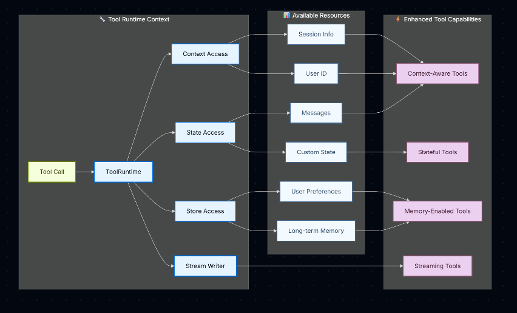

# Tools(工具)

> 原文:[Tools](https://docs.langchain.com/oss/python/langchain/tools)

工具(Tools)扩展了 [Agent](https://docs.langchain.com/oss/python/langchain/agents) 的能力——让它们能够获取实时数据、执行代码、查询外部数据库,并在现实世界中采取行动。

在底层,工具是具有明确定义的输入和输出的可调用函数,会被传递给[对话模型](https://docs.langchain.com/oss/python/langchain/models)。模型根据对话上下文决定何时调用工具,以及提供什么输入参数。

> **提示**
>
> 关于模型如何处理工具调用的细节,参见[工具调用](https://docs.langchain.com/oss/python/langchain/models#工具调用tool-calling)。使用 [LangSmith](https://smith.langchain.com) 追踪工具调用并调试错误。可参考[追踪快速入门](https://docs.langchain.com/langsmith/trace-with-langchain)完成配置。我们还建议同时配置 [LangSmith Engine](https://docs.langchain.com/langsmith/engine),它可以监控你的追踪数据、检测问题并提出修复建议。

## 创建工具

### 基本工具定义

创建工具最简单的方式是使用 [`@tool`](https://reference.langchain.com/python/langchain-core/tools/convert/tool) 装饰器。默认情况下,函数的 docstring 会成为工具的描述,帮助模型理解何时该使用它:

```python
from langchain.tools import tool

@tool
def search_database(query: str, limit: int = 10) -> str:
    """Search the customer database for records matching the query.

    Args:
        query: Search terms to look for
        limit: Maximum number of results to return
    """
    return f"Found {limit} results for '{query}'"
```

类型注解(type hints)是**必需的**,因为它们定义了工具的输入 schema。docstring 应当信息充分且简洁,以帮助模型理解工具的用途。

> **注意:服务器端工具使用:** 部分对话模型具备内置工具(网页搜索、代码解释器),由服务器端执行。详情参见[服务器端工具使用](#服务器端工具使用server-side-tool-use)。

> **警告**:工具名称建议使用 `snake_case`(例如用 `web_search` 而不是 `Web Search`)。部分模型提供商对包含空格或特殊字符的名称会有问题或报错拒绝。坚持使用字母、数字、下划线和连字符有助于提升跨提供商的兼容性。

### 自定义工具属性

#### 自定义工具名称

默认情况下,工具名称取自函数名。需要更具描述性的名称时可以覆盖:

```python
@tool("web_search")  # 自定义名称
def search(query: str) -> str:
    """Search the web for information."""
    return f"Results for: {query}"

print(search.name)  # web_search
```

#### 自定义工具描述

覆盖自动生成的工具描述,为模型提供更清晰的指引:

```python
@tool("calculator", description="Performs arithmetic calculations. Use this for any math problems.")
def calc(expression: str) -> str:
    """Evaluate mathematical expressions."""
    return str(eval(expression))
```

### 高级 schema 定义

使用 Pydantic 模型或 JSON schema 定义复杂输入:

**Pydantic 模型:**

```python
from pydantic import BaseModel, Field
from typing import Literal

class WeatherInput(BaseModel):
    """天气查询的输入。"""
    location: str = Field(description="City name or coordinates")
    units: Literal["celsius", "fahrenheit"] = Field(
        default="celsius",
        description="Temperature unit preference"
    )
    include_forecast: bool = Field(
        default=False,
        description="Include 5-day forecast"
    )

@tool(args_schema=WeatherInput)
def get_weather(location: str, units: str = "celsius", include_forecast: bool = False) -> str:
    """Get current weather and optional forecast."""
    temp = 22 if units == "celsius" else 72
    result = f"Current weather in {location}: {temp} degrees {units[0].upper()}"
    if include_forecast:
        result += "\nNext 5 days: Sunny"
    return result
```

**JSON Schema:**

```python
weather_schema = {
    "type": "object",
    "properties": {
        "location": {"type": "string"},
        "units": {"type": "string"},
        "include_forecast": {"type": "boolean"}
    },
    "required": ["location", "units", "include_forecast"]
}

@tool(args_schema=weather_schema)
def get_weather(location: str, units: str = "celsius", include_forecast: bool = False) -> str:
    """Get current weather and optional forecast."""
    temp = 22 if units == "celsius" else 72
    result = f"Current weather in {location}: {temp} degrees {units[0].upper()}"
    if include_forecast:
        result += "\nNext 5 days: Sunny"
    return result
```

### 保留的参数名

以下参数名是保留的,不能用作工具参数。使用这些名称会导致运行时错误。

| 参数名 | 用途 |
| -------------- | ---------------------------------------------------------------------- |
| `config`       | 保留用于在内部向工具传递 `RunnableConfig` |
| `runtime`      | 保留用于 `ToolRuntime` 参数(访问 state、context、store) |

要访问运行时信息,请使用 [`ToolRuntime`](https://reference.langchain.com/python/langchain/tools/#langchain.tools.ToolRuntime) 参数,而不是把自己的参数命名为 `config` 或 `runtime`。

如果你使用了 `InjectedState`、`InjectedStore`、`get_runtime()` 或 `InjectedToolCallId`,参见[从旧版注入模式迁移](#从旧版注入模式迁移)。

## 访问上下文(Access context)

当工具可以访问运行时信息(如对话历史、用户数据和持久化记忆)时,它们的能力最为强大。本节介绍如何在工具内部访问和更新这些信息。

工具可以通过 [`ToolRuntime`](https://reference.langchain.com/python/langchain/tools/#langchain.tools.ToolRuntime) 参数访问运行时信息,它提供:

| 组件 | 说明 | 使用场景 |
| ------------------ | --------------------------------------------------------------------------------------------------------------------------- | ----------------------------------------------------------- |
| **State(状态)** | 短期记忆——当前对话期间存在的可变数据(消息、计数器、自定义字段) | 访问对话历史、跟踪工具调用次数 |
| **Context(上下文)** | 调用时传入的不可变配置(用户 ID、会话信息) | 基于用户身份个性化响应 |
| **Store(存储)** | 长期记忆——跨对话存活的持久化数据 | 保存用户偏好、维护知识库 |
| **Stream Writer(流写入器)** | 在工具执行期间发出实时更新 | 为长时间运行的操作显示进度 |
| **Execution Info(执行信息)** | 当前执行的身份与重试信息(thread ID、run ID、尝试次数) | 访问 thread/run ID、根据重试状态调整行为 |
| **Server Info(服务器信息)** | 运行在 LangGraph Server 上时的服务器特有元数据(assistant ID、graph ID、已认证用户) | 访问 assistant ID、graph ID 或已认证用户信息 |
| **Config(配置)** | 本次执行的 [`RunnableConfig`](https://reference.langchain.com/python/langchain-core/runnables/config/RunnableConfig) | 访问回调、标签和元数据 |
| **Tool Call ID(工具调用 ID)** | 当前工具调用的唯一标识符 | 关联工具调用的日志和模型调用 |




### 短期记忆(State)

State 表示在对话期间存在的短期记忆。它包含消息历史以及你在[图状态(graph state)](https://docs.langchain.com/oss/python/langgraph/graph-api#state)中定义的任何自定义字段。

#### 访问 state

在工具签名中添加 `runtime: ToolRuntime` 即可访问 state。调用时,[`ToolNode`](https://reference.langchain.com/python/langgraph/agents/#langgraph.prebuilt.tool_node.ToolNode) 会自动注入该值;该参数不会包含在发送给模型的工具 schema 中。使用 `runtime.state` 读取当前对话状态:

```python
from langchain.tools import tool, ToolRuntime
from langchain.messages import HumanMessage

@tool
def get_last_user_message(runtime: ToolRuntime) -> str:
    """获取用户最近的一条消息。"""
    messages = runtime.state["messages"]

    # 找到最后一条人类消息
    for message in reversed(messages):
        if isinstance(message, HumanMessage):
            return message.content

    return "No user messages found"

# 访问自定义 state 字段
@tool
def get_user_preference(
    pref_name: str,
    runtime: ToolRuntime
) -> str:
    """获取某个用户偏好值。"""
    preferences = runtime.state.get("user_preferences", {})
    return preferences.get(pref_name, "Not set")
```

> **警告**:`runtime` 参数对模型是隐藏的。对于上面的示例,模型在工具 schema 中只能看到 `pref_name`。

#### 更新 state

使用 [`Command`](https://reference.langchain.com/python/langgraph/types/Command) 更新 Agent 的状态。这对需要更新自定义 state 字段的工具很有用。在更新中包含一条 `ToolMessage`,这样模型就能看到工具调用的结果:

```python
from langchain.agents import AgentState
from langchain.messages import ToolMessage
from langchain.tools import ToolRuntime, tool
from langgraph.types import Command


class CustomState(AgentState):
    user_name: str


@tool
def set_user_name(new_name: str, runtime: ToolRuntime[None, CustomState]) -> Command:
    """在对话状态中设置用户的名字。"""
    return Command(
        update={
            "user_name": new_name,
            "messages": [
                ToolMessage(
                    content=f"User name set to {new_name}.",
                    tool_call_id=runtime.tool_call_id,
                )
            ],
        }
    )
```

> **提示**:当工具更新 state 变量时,考虑为这些字段定义一个 [reducer](https://docs.langchain.com/oss/python/langgraph/graph-api#reducers)。由于 LLM 可以并行调用多个工具,reducer 决定了当同一 state 字段被并发的工具调用更新时如何解决冲突。

### Context(上下文)

Context 提供在调用时传入的不可变配置数据。将其用于用户 ID、会话详情,或在对话期间不应改变的应用特定设置。

> **注意**:`thread_id`(通过 `config={"configurable": {"thread_id": ...}}` 传入)的作用域是*对话*:消息历史和检查点;而 `context` 携带的是工具与中间件在调用时读取的*每次运行*的数据。在生产环境中,你通常会把两者一起传入:每个对话一个稳定的 `thread_id`,每次 invoke 一个 `context` 对象。

通过 `runtime.context` 访问上下文。将它与 `thread_id` 一起传入,以便对话跨轮次持久化:

```python
from dataclasses import dataclass

from langchain.agents import create_agent
from langchain.tools import tool, ToolRuntime
from langchain_core.utils.uuid import uuid7
from langchain_openai import ChatOpenAI


USER_DATABASE = {
    "user123": {
        "name": "Alice Johnson",
        "account_type": "Premium",
        "balance": 5000,
        "email": "alice@example.com",
    },
    "user456": {
        "name": "Bob Smith",
        "account_type": "Standard",
        "balance": 1200,
        "email": "bob@example.com",
    },
}


@dataclass
class UserContext:
    user_id: str


@tool
def get_account_info(runtime: ToolRuntime[UserContext]) -> str:
    """获取当前用户的账户信息。"""
    user_id = runtime.context.user_id

    if user_id in USER_DATABASE:
        user = USER_DATABASE[user_id]
        return (
            f"Account holder: {user['name']}\n"
            f"Type: {user['account_type']}\n"
            f"Balance: ${user['balance']}"
        )
    return "User not found"


model = ChatOpenAI(model="openai:gpt-5.5")
agent = create_agent(
    model,
    tools=[get_account_info],
    context_schema=UserContext,
    system_prompt="You are a financial assistant.",
)

result = agent.invoke(
    {"messages": [{"role": "user", "content": "What's my current balance?"}]},
    config={"configurable": {"thread_id": str(uuid7())}},
    context=UserContext(user_id="user123"),
)
```

> 以上以 OpenAI 为例;其他提供商只需替换模型标识符,如 `"google_genai:gemini-3.6-flash"`、`"anthropic:claude-sonnet-4-6"`、`"openrouter:z-ai/glm-5.2"` 等。

### 长期记忆(Store)

[`BaseStore`](https://reference.langchain.com/python/langchain-core/stores/BaseStore) 提供跨对话存活的持久化存储。与 state(短期记忆)不同,保存到 store 的数据在未来的会话中仍然可用。

通过 `runtime.store` 访问存储。Store 使用命名空间/键(namespace/key)模式组织数据:

> **提示**:生产部署时,请使用持久化的 store 实现,如 [`PostgresStore`](https://reference.langchain.com/python/langgraph/store/#langgraph.store.postgres.PostgresStore)、`MongoDBStore` 或 `RedisStore`,而不是 `InMemoryStore`。配置细节参见[记忆文档](https://docs.langchain.com/oss/python/langgraph/add-memory)。

```python
from typing import Any
from langgraph.store.memory import InMemoryStore
from langchain.agents import create_agent
from langchain.tools import tool, ToolRuntime
from langchain_openai import ChatOpenAI

# 访问记忆
@tool
def get_user_info(user_id: str, runtime: ToolRuntime) -> str:
    """查找用户信息。"""
    store = runtime.store
    user_info = store.get(("users",), user_id)
    return str(user_info.value) if user_info else "Unknown user"

# 更新记忆
@tool
def save_user_info(user_id: str, user_info: dict[str, Any], runtime: ToolRuntime) -> str:
    """保存用户信息。"""
    store = runtime.store
    store.put(("users",), user_id, user_info)
    return "Successfully saved user info."

model = ChatOpenAI(model="gpt-5.5")

store = InMemoryStore()
agent = create_agent(
    model,
    tools=[get_user_info, save_user_info],
    store=store
)

# 第一个会话:保存用户信息
agent.invoke({
    "messages": [{"role": "user", "content": "Save the following user: userid: abc123, name: Foo, age: 25, email: foo@langchain.dev"}]
})

# 第二个会话:获取用户信息
agent.invoke({
    "messages": [{"role": "user", "content": "Get user info for user with id 'abc123'"}]
})
# Here is the user info for user with ID "abc123":
# - Name: Foo
# - Age: 25
# - Email: foo@langchain.dev
```

### Stream writer(流写入器)

在工具执行期间流式发出实时更新。这对于在长时间运行的操作中向用户提供进度反馈很有用。

使用 `runtime.stream_writer` 发出自定义更新:

```python
from langchain.tools import tool, ToolRuntime

@tool
def get_weather(city: str, runtime: ToolRuntime) -> str:
    """获取指定城市的天气。"""
    writer = runtime.stream_writer

    # 在工具执行过程中流式发出自定义更新
    writer(f"Looking up data for city: {city}")
    writer(f"Acquired data for city: {city}")

    return f"It's always sunny in {city}!"
```

> **注意**:如果你在工具中使用 `runtime.stream_writer`,该工具必须在 LangGraph 执行上下文中被调用。更多细节参见 [Streaming](https://docs.langchain.com/oss/python/langchain/streaming)。

### Execution info(执行信息)

通过 `runtime.execution_info` 在工具内部访问 thread ID、run ID 和重试状态:

```python
from langchain.tools import tool, ToolRuntime

@tool
def log_execution_context(runtime: ToolRuntime) -> str:
    """记录执行身份信息。"""
    info = runtime.execution_info
    print(f"Thread: {info.thread_id}, Run: {info.run_id}")
    print(f"Attempt: {info.node_attempt}")
    return "done"
```

> **注意**:需要 `deepagents>=0.5.0`(或 `langgraph>=1.1.5`)。

### Server info(服务器信息)

当工具运行在 LangGraph Server 上时,通过 `runtime.server_info` 访问 assistant ID、graph ID 和已认证用户:

```python
from langchain.tools import tool, ToolRuntime

@tool
def get_assistant_scoped_data(runtime: ToolRuntime) -> str:
    """获取当前 assistant 作用域内的数据。"""
    server = runtime.server_info
    if server is not None:
        print(f"Assistant: {server.assistant_id}, Graph: {server.graph_id}")
        if server.user is not None:
            print(f"User: {server.user.identity}")
    return "done"
```

当工具没有运行在 LangGraph Server 上时(例如本地开发或测试期间),`server_info` 为 `None`。

> **注意**:需要 `deepagents>=0.5.0`(或 `langgraph>=1.1.5`)。

### 从旧版注入模式迁移

旧版示例使用了 `InjectedState`、`InjectedStore`、`get_runtime()` 或 `InjectedToolCallId`。请改用 [`ToolRuntime`](https://reference.langchain.com/python/langchain/tools/#langchain.tools.ToolRuntime),它为 state、context、store 和执行元数据提供了一个统一的显式接口。

**旧模式:**

```python
from langchain.tools import tool, InjectedState

@tool
def summarize(state: InjectedState) -> str:
    """总结对话。"""
    messages = state["messages"]
    return f"Conversation length: {len(messages)} messages."
```

**推荐模式:**

```python
from langchain.tools import tool, ToolRuntime

@tool
def summarize(runtime: ToolRuntime) -> str:
    """总结对话。"""
    messages = runtime.state["messages"]
    return f"Conversation length: {len(messages)} messages."
```

关于 Agent 级别的迁移(例如 `create_react_agent` 和自定义 state),参见 [LangChain v1 迁移指南](https://docs.langchain.com/oss/python/migrate/langchain-v1)。

## 工具执行(Tool execution)

在 LangChain 中,工具由 Agent 使用(例如通过 [`create_agent`](https://reference.langchain.com/python/langchain/agents/factory/create_agent)),工具错误处理通过[中间件](https://docs.langchain.com/oss/python/langchain/middleware)配置。

对于 LangGraph 工作流,工具执行由 [`ToolNode`](https://reference.langchain.com/python/langgraph/agents/#langgraph.prebuilt.tool_node.ToolNode) 处理。Graph API 的用法(包括工具如何访问当前图状态和运行作用域的上下文)参见 [ToolNode](https://docs.langchain.com/oss/python/langgraph/workflows-agents#toolnode)。

### 工具返回值

你可以为工具选择不同的返回值:

- 返回 `string`:人类可读的结果。
- 返回 `object`:供模型解析的结构化结果。
- 返回带可选消息的 `Command`:需要写入 state 时。

#### 返回字符串

当工具应提供纯文本供模型阅读并在下一次响应中使用时,返回字符串。

```python
from langchain.tools import tool


@tool
def get_weather(city: str) -> str:
    """获取某城市的天气。"""
    return f"It is currently sunny in {city}."
```

行为:

- 返回值会被转换为 `ToolMessage`。
- 模型看到该文本并决定下一步做什么。
- 除非模型或其他工具稍后这样做,否则不会改变任何 Agent state 字段。

当结果天然是人类可读的文本时使用这种方式。

#### 返回对象

当工具产生模型应当检查的结构化数据时,返回对象(例如 `dict`)。

```python
from langchain.tools import tool


@tool
def get_weather_data(city: str) -> dict:
    """获取某城市的结构化天气数据。"""
    return {
        "city": city,
        "temperature_c": 22,
        "conditions": "sunny",
    }
```

行为:

- 对象会被序列化并作为工具输出发回。
- 模型可以读取特定字段并基于它们进行推理。
- 与字符串返回一样,这不会直接更新图状态。

当下游推理受益于显式字段而非自由文本时使用这种方式。

#### 返回多模态内容

工具不限于纯文本。当模型支持多模态工具结果时,工具可以返回[标准内容块](https://docs.langchain.com/oss/python/langchain/messages#standard-content-blocks),使模型在一个工具结果中接收文本、图像和其他媒体。

```python
from langchain.tools import tool


@tool
def capture_screenshot() -> list[dict]:
    """截取当前页面的截图。"""
    return [
        {"type": "text", "text": "Screenshot of the current page:"},
        {"type": "image", "url": "https://example.com/page.png"},
    ]
```

行为:

- 返回值会被转换为带多模态 `content` 的 `ToolMessage`。
- 工具运行后,使用 `message.content_blocks` 读取规范化后的块列表。
- 模型必须支持你返回的模态。返回图像、音频或视频前,请检查[模型能力](https://docs.langchain.com/oss/python/integrations/chat)。

块类型和提供商特定要求参见[多模态消息](https://docs.langchain.com/oss/python/langchain/messages#multimodal)。返回图像或混合内容的 MCP 工具会以相同方式转换;参见[多模态工具内容](https://docs.langchain.com/oss/python/langchain/mcp#multimodal-tool-content)。

#### 返回 Command

当工具需要更新图状态时(例如设置用户偏好或应用状态),返回 [`Command`](https://reference.langchain.com/python/langgraph/types/Command)。当 `Command` 目标是当前图时,在更新中包含一条 `ToolMessage`,其 tool call ID 与当前工具调用匹配。消息历史中的每个工具调用都必须有对应的 `ToolMessage`。

`tool_call_id` 参数请使用 `runtime.tool_call_id`。`ToolNode` 会强制执行这一要求:如果更新中没有与工具调用匹配的 `ToolMessage`,它会抛出 `ValueError`。

```python
from langchain.messages import ToolMessage
from langchain.tools import ToolRuntime, tool
from langgraph.types import Command


@tool
def set_language(language: str, runtime: ToolRuntime) -> Command:
    """设置首选响应语言。"""
    return Command(
        update={
            "preferred_language": language,
            "messages": [
                ToolMessage(
                    content=f"Language set to {language}.",
                    tool_call_id=runtime.tool_call_id,
                )
            ],
        }
    )
```

行为:

- Command 使用 `update` 更新状态。
- 更新后的状态在同一次运行的后续步骤中可用。
- 对可能被并行工具调用更新的字段使用 reducer。

当工具不仅返回数据、还要修改 Agent 状态时使用这种方式。

#### 从工具直接返回(return direct)

为工具设置 return direct 可以短路 Agent 循环:Agent 立刻把工具的输出返回给调用方,不再把它送回模型做进一步处理。

```python
from langchain.agents import create_agent
from langchain.tools import tool
from langchain_openai import ChatOpenAI


@tool(return_direct=True)
def fetch_order_status(order_id: str) -> str:
    """获取客户订单的当前状态。"""
    # 在生产环境中,在这里查询你的订单管理系统
    return f"Order {order_id} is shipped and will arrive in 2 days."


agent = create_agent(
    ChatOpenAI(model="openai:gpt-5.5"),
    tools=[fetch_order_status],
)

result = agent.invoke({
    "messages": [{"role": "user", "content": "What is the status of order #12345?"}]
})
# Agent 直接返回工具输出,不再进行另一次 LLM 调用:
# "Order 12345 is shipped and will arrive in 2 days."
```

行为:

- 工具正常执行,其输出被包装成 `ToolMessage`。
- Agent 停止循环,把工具的输出作为最终响应返回,跳过任何额外的模型调用。
- **多个并行工具调用:**当模型在一步中调用多个工具时,它们都会先执行。全部工具完成后,只有当该批次中**每个**工具都有 `return_direct=True` 时,Agent 才会路由到 `END`。最终响应包含该步骤中被调用的所有工具的 `ToolMessage` 输出。

适用场景:

- 工具的输出就是完整的、可直接展示给用户的答案(例如一个返回即可显示的查询结果)。
- 不需要额外推理时,想避免一次额外的模型调用。
- 需要确定性的、未经修改的输出:模型无法改写、总结或对工具结果采取行动。

> **警告**:由于模型不会处理工具的输出,`return_direct=True` 不适合结果需要进一步推理、总结或与其他工具调用串联的工具。

> **警告:混合并行调用:**如果模型同时调用了带 `return_direct=True` 的工具和不带的工具,Agent 在该步骤后**不会**退出。它会带着批次中所有 `ToolMessage` 路由回模型,让模型对所有结果进行推理。只有当该步骤中的每个工具调用都有 `return_direct=True` 时,`return_direct` 才会短路循环。

#### 返回带 return_direct 的 Command

带 `return_direct=True` 的工具也可以返回 [`Command`](https://reference.langchain.com/python/langgraph/types/Command),在 Agent 退出前更新图状态。与普通返回值不同,`Command` 不会自动转换为 `ToolMessage`。当 `Command` 目标是当前图(`graph` 未设置或为 `None`)时,需要在 `Command.update` 中包含一条与工具调用的 `tool_call_id` 匹配的 `ToolMessage`。省略它会导致 `ToolNode` 抛出 `ValueError`,因为每个 `AIMessage` 的工具调用在消息历史中都必须有对应的 `ToolMessage`。

```python
from langchain.messages import ToolMessage
from langchain.tools import ToolRuntime, tool
from langgraph.types import Command


@tool(return_direct=True)
def fetch_and_store_order(order_id: str, runtime: ToolRuntime) -> Command:
    """获取订单状态并保存到 state。"""
    status = f"Order {order_id} is shipped and will arrive in 2 days."
    return Command(
        update={
            "last_order_status": status,
            # 必须包含 ToolMessage,以保持消息历史有效
            "messages": [
                ToolMessage(
                    content=status,
                    tool_call_id=runtime.tool_call_id,
                )
            ],
        }
    )
```

如果要写入父图,请设置 `graph=Command.PARENT`。在这种情况下 `ToolMessage` 要求被豁免,因为执行完全离开了当前图。

### 错误处理

使用 LangChain Agent [中间件](https://docs.langchain.com/oss/python/langchain/middleware)处理工具错误,以重试失败的工具调用或返回自定义错误消息:

```python
from collections.abc import Callable

from langchain.agents import create_agent
from langchain.agents.middleware import wrap_tool_call
from langchain.messages import ToolMessage
from langchain.tools.tool_node import ToolCallRequest


@wrap_tool_call
def handle_tool_errors(
    request: ToolCallRequest,
    handler: Callable[[ToolCallRequest], ToolMessage],
) -> ToolMessage:
    """把工具异常转换成模型可以处理的 ToolMessage。"""
    try:
        return handler(request)
    except Exception as e:
        return ToolMessage(
            content=f"Tool error: Please check your input and try again. ({e})",
            tool_call_id=request.tool_call["id"],
        )


agent = create_agent(
    model="openai:gpt-5.5",
    tools=[],
    middleware=[handle_tool_errors],
)
```

### 状态注入(State injection)

工具通过 [`ToolRuntime`](https://reference.langchain.com/python/langchain/tools/#langchain.tools.ToolRuntime) 访问图状态。关于 state、context、store 和流式 API,参见[访问上下文](#访问上下文access-context)。

```python
from langchain.tools import tool, ToolRuntime

@tool
def get_message_count(runtime: ToolRuntime) -> str:
    """获取对话中的消息数量。"""
    messages = runtime.state["messages"]
    return f"There are {len(messages)} messages."
```

关于从工具访问 state、context 和长期记忆的更多细节,参见[访问上下文](#访问上下文access-context)。

## 动态工具选择(Dynamic tool selection)

借助动态工具,Agent 可用的工具集合可以在运行时修改,而不是在开始就全部定义好。并非每个工具都适合每种情况。工具过多可能让模型不堪重负(上下文过载)并增加错误;工具过少则限制能力。动态工具选择可以根据认证状态、用户权限、功能开关或对话阶段调整可用工具集。

根据工具是否预先已知,有两种方式:

### 过滤预注册的工具

当所有可能的工具在创建 Agent 时就已知,你可以预注册它们,并根据 state、权限或上下文动态过滤暴露给模型的工具。

**基于 State:**仅在特定对话里程碑之后启用高级工具:

```python
from langchain.agents import create_agent
from langchain.agents.middleware import wrap_model_call, ModelRequest, ModelResponse
from typing import Callable

@wrap_model_call
def state_based_tools(
    request: ModelRequest,
    handler: Callable[[ModelRequest], ModelResponse]
) -> ModelResponse:
    """根据对话 State 过滤工具。"""
    # 从 State 读取:检查用户是否已认证
    state = request.state
    is_authenticated = state.get("authenticated", False)
    message_count = len(state["messages"])

    # 只有认证后才启用敏感工具
    if not is_authenticated:
        tools = [t for t in request.tools if t.name.startswith("public_")]
        request = request.override(tools=tools)
    elif message_count < 5:
        # 在对话早期限制工具
        tools = [t for t in request.tools if t.name != "advanced_search"]
        request = request.override(tools=tools)

    return handler(request)

agent = create_agent(
    model="gpt-5.5",
    tools=[public_search, private_search, advanced_search],
    middleware=[state_based_tools]
)
```

**基于 Store:**根据 Store 中的用户偏好或功能开关过滤工具:

```python
from dataclasses import dataclass
from langchain.agents import create_agent
from langchain.agents.middleware import wrap_model_call, ModelRequest, ModelResponse
from typing import Callable
from langgraph.store.memory import InMemoryStore

@dataclass
class Context:
    user_id: str

@wrap_model_call
def store_based_tools(
    request: ModelRequest,
    handler: Callable[[ModelRequest], ModelResponse]
) -> ModelResponse:
    """根据 Store 偏好过滤工具。"""
    user_id = request.runtime.context.user_id

    # 从 Store 读取:获取用户启用的特性
    store = request.runtime.store
    feature_flags = store.get(("features",), user_id)

    if feature_flags:
        enabled_features = feature_flags.value.get("enabled_tools", [])
        # 只包含为该用户启用的工具
        tools = [t for t in request.tools if t.name in enabled_features]
        request = request.override(tools=tools)

    return handler(request)

agent = create_agent(
    model="gpt-5.5",
    tools=[search_tool, analysis_tool, export_tool],
    middleware=[store_based_tools],
    context_schema=Context,
    store=InMemoryStore()
)
```

**基于 Runtime Context:**根据运行时上下文中的用户权限过滤工具:

```python
from dataclasses import dataclass
from langchain.agents import create_agent
from langchain.agents.middleware import wrap_model_call, ModelRequest, ModelResponse
from typing import Callable

@dataclass
class Context:
    user_role: str

@wrap_model_call
def context_based_tools(
    request: ModelRequest,
    handler: Callable[[ModelRequest], ModelResponse]
) -> ModelResponse:
    """根据运行时上下文权限过滤工具。"""
    # 从运行时上下文读取:获取用户角色
    if request.runtime is None or request.runtime.context is None:
        # 未提供上下文时,默认为 viewer(限制最严格)
        user_role = "viewer"
    else:
        user_role = request.runtime.context.user_role

    if user_role == "admin":
        # 管理员拥有全部工具
        pass
    elif user_role == "editor":
        # 编辑不能删除
        tools = [t for t in request.tools if t.name != "delete_data"]
        request = request.override(tools=tools)
    else:
        # 浏览者只有只读工具
        tools = [t for t in request.tools if t.name.startswith("read_")]
        request = request.override(tools=tools)

    return handler(request)

agent = create_agent(
    model="gpt-5.5",
    tools=[read_data, write_data, delete_data],
    middleware=[context_based_tools],
    context_schema=Context
)
```

这种方式最适合:

- 所有可能的工具在编译/启动时已知
- 想基于权限、功能开关或对话状态过滤
- 工具是静态的,但其可用性是动态的

更多示例参见[动态选择工具](https://docs.langchain.com/oss/python/langchain/middleware/custom#dynamically-selecting-tools)。

### 运行时工具注册

当工具是在运行时被发现或创建的(例如从 MCP 服务器加载、基于用户数据生成,或从远程注册表获取),你既需要注册工具,也需要动态处理它们的执行。

这需要两个中间件钩子:

1. `wrap_model_call` —— 把动态工具添加到请求中
2. `wrap_tool_call` —— 处理动态添加工具的执行

```python
from langchain.tools import tool
from langchain.agents import create_agent
from langchain.agents.middleware import AgentMiddleware, ModelRequest, ToolCallRequest

# 一个将在运行时动态添加的工具
@tool
def calculate_tip(bill_amount: float, tip_percentage: float = 20.0) -> str:
    """计算账单的小费金额。"""
    tip = bill_amount * (tip_percentage / 100)
    return f"Tip: ${tip:.2f}, Total: ${bill_amount + tip:.2f}"

class DynamicToolMiddleware(AgentMiddleware):
    """注册并处理动态工具的中间件。"""

    def wrap_model_call(self, request: ModelRequest, handler):
        # 把动态工具添加到请求中
        # 这可以从 MCP 服务器、数据库等加载
        updated = request.override(tools=[*request.tools, calculate_tip])
        return handler(updated)

    def wrap_tool_call(self, request: ToolCallRequest, handler):
        # 处理动态工具的执行
        if request.tool_call["name"] == "calculate_tip":
            return handler(request.override(tool=calculate_tip))
        return handler(request)

agent = create_agent(
    model="gpt-5.5",
    tools=[get_weather],  # 这里只注册静态工具
    middleware=[DynamicToolMiddleware()],
)

# Agent 现在可以同时使用 get_weather 和 calculate_tip
result = agent.invoke({
    "messages": [{"role": "user", "content": "Calculate a 20% tip on $85"}]
})
```

这种方式最适合:

- 工具在运行时被发现(例如来自 MCP 服务器)
- 工具基于用户数据或配置动态生成
- 你在与外部工具注册表集成

> **注意**:运行时注册的工具需要 `wrap_tool_call` 钩子,因为 Agent 需要知道如何执行不在原始工具列表中的工具。没有它,Agent 将不知道如何调用动态添加的工具。

## Headless tools(无头工具)

有些工具应该在**用户应用运行的地方**(通常是浏览器)执行,而不是在服务器进程内。**Headless tools** 是工具定义——包含名称、描述和参数 schema——你在**服务器端**把它们注册到 Agent 上。其**实现**只注册在**客户端**,并经过一次简短的 interrupt/resume(中断/恢复)握手后执行。

这与函数体运行在服务器上的普通工具不同,也与[服务器端工具使用](#服务器端工具使用server-side-tool-use)(由模型提供商远程执行内置工具)不同。

### 何时使用 headless tools

当工作依赖于只存在于客户端的**环境、设备或 UI** 时使用它们。例如:

- **浏览器 API:**地理位置、IndexedDB、剪贴板、Canvas 2D、文件选择器、Battery API 等。
- **隐私与本地性:**数据留在设备上(例如 IndexedDB 中的本地"记忆")。
- **延迟:**纯本地操作无需额外的服务器往返。
- **结构化、安全的效果:**优先使用许多小而带类型的工具(例如每种 canvas 原语一个工具),而不是把任意代码发给 `eval`。

### 该模式如何工作

在两种运行时中,模型看到的都是它可以正常调用的工具,但实际执行发生在服务器进程之外。

1. **定义**:使用 `langchain.tools` 的 `tool(name=..., description=..., args_schema=...)` 定义 headless 工具。Headless 工具只有 schema,没有进程内实现。
2. **注册**:将该工具注册到 `create_agent` 或你的 LangGraph 图中,使模型可以正常调用它。
3. **处理**:当工具被调用时处理 interrupt 载荷(payload)。图不会本地执行,而是以一个形如 `{"type": "tool", "tool_call": {"id", "name", "args"}}` 的载荷暂停。
4. **恢复**:在你的应用、其他服务或人工步骤执行完动作后恢复(resume)图。对于基于浏览器的流程,你可以在前端镜像 schema 并在那里附加 `.implement(...)`。

> **说明**:如果你在 Python 中只带 `name`、`description` 和 `args_schema` 调用 `tool(...)`,LangChain 会返回一个 `HeadlessTool`。Python 端没有 `.implement()` API。

当模型为这些工具之一发起工具调用时,运行会**中断**而不是本地执行工具。你的应用可以检查载荷,在正确的环境中执行动作(例如浏览器、其他服务或人工审核步骤),然后带着工具结果**恢复**图。当你使用受支持的 JS SDK 钩子时,它们可以检测 headless 工具的中断、运行匹配的客户端实现,并替你提交恢复命令。

使用可选的 **`onTool`** 回调观察生命周期事件(`start`、`success`、`error`),用于 UI 反馈,如加载动画或 toast。

关于使用 `useStream` 在客户端执行 schema-only 工具的端到端示例,参见 [Headless tools 前端模式](https://docs.langchain.com/oss/python/langchain/frontend/headless-tools)。

## 预构建工具(Prebuilt tools)

LangChain 提供了大量预构建的工具和工具包(toolkits),用于网页搜索、代码解释、数据库访问等常见任务。这些开箱即用的工具可以直接集成到你的 Agent 中,无需编写自定义代码。

完整的可用工具列表(按类别组织)参见[工具与工具包](https://docs.langchain.com/oss/python/integrations/tools)集成页面。

## 服务器端工具使用(Server-side tool use)

部分对话模型具备由模型提供商在服务器端执行的内置工具。这些能力包括网页搜索和代码解释器等,无需你定义或托管工具逻辑。

关于如何启用和使用这些内置工具的详情,参见各[对话模型集成页面](https://docs.langchain.com/oss/python/integrations/providers)和[工具调用文档](https://docs.langchain.com/oss/python/langchain/models#服务器端工具使用server-side-tool-use)。
