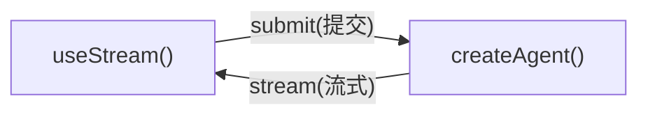

# Frontend 概览(前端概览)

> 利用 LangChain Agent 的实时流式输出构建生成式 UI

> 原文:[Frontend Overview](https://docs.langchain.com/oss/python/langchain/frontend/overview)

为使用 `createAgent` 创建的 Agent 构建丰富、可交互的前端。这些模式涵盖了从基础的消息渲染,到人机协同(human-in-the-loop)审批、排队提交、持久化流重连(durable stream rejoin)和时间旅行调试(time travel debugging)等高级工作流的一切。

LangChain 前端 SDK 是为 **Agent 应用**而构建的,而不仅仅是逐 token 流式输出的聊天机器人。渲染消息所用的同一个 hook,同时也暴露了 Agent 的持久化线程状态、工具调用生命周期、中断(interrupts)、检查点(checkpoint)历史和自定义状态值,因此你的 UI 可以成为长时间运行的 Agent 工作的控制面(control plane)。

> **注意**
>
> 这些模式使用 v1 版本的前端 SDK 包。如果你使用的是更早的版本,请参见 [React](https://github.com/langchain-ai/langgraphjs/blob/main/libs/sdk-react/docs/v1-migration.md)、[Vue](https://github.com/langchain-ai/langgraphjs/blob/main/libs/sdk-vue/docs/v1-migration.md)、[Svelte](https://github.com/langchain-ai/langgraphjs/blob/main/libs/sdk-svelte/docs/v1-migration.md) 和 [Angular](https://github.com/langchain-ai/langgraphjs/blob/main/libs/sdk-angular/docs/v1-migration.md) 的迁移指南。

## 架构(Architecture)

所有模式都遵循相同的架构:`createAgent` 后端通过 SDK 流式 API 向前端流式传输状态。



在后端,`createAgent` 生成一个编译后的 LangGraph 图,并暴露流式 API。在前端,流句柄(stream handle)连接到该 API,并提供响应式状态——消息、工具调用、中断、值和线程元数据——你可以用任何框架来渲染它们。

## 为什么使用 LangChain 前端 SDK?

大多数 AI UI 库帮助你把流式文本追加到聊天记录中。LangChain 的 SDK 暴露了生产级 Agent 所需的更丰富的运行时语义:

| 能力 | 在你的 UI 中能实现什么 |
| ------------------------------- | -------------------------------------------------------------------------------------------------------------------------------- |
| **持久化线程(Durable threads)** | 重新加载页面、切换设备或重新加入一次运行,都不会丢失对话状态。 |
| **带类型的 Agent 状态(Typed agent state)** | 渲染任意 state 键,而不仅仅是消息:待办事项、管道输出、引用、沙箱文件、指标或自定义业务对象。 |
| **工具调用生命周期(Tool-call lifecycle)** | 把待处理、已完成和失败的工具调用展示为专门设计的 UI 卡片,而不是原始 JSON。 |
| **中断(Interrupts)** | 为人工审批、编辑或补充缺失信息而暂停执行,然后从 Agent 停止的确切位置恢复。 |
| **检查点(Checkpoints)** | 基于持久化的状态快照构建编辑、重试、分支、审计和时间旅行流程。 |
| **嵌套执行(Nested execution)** | 可视化深度 Agent、子 Agent 和图节点,而不必把一切压平成一个不可读的流。 |
| **框架原生的响应式(Framework-native reactivity)** | 在 React、Vue、Svelte 或 Angular 中使用同一个协议,同时保留各自惯用的 hooks、composables、stores 或 signals。 |

这些原语让你可以设计出这样的 UI:用户可以在 Agent 工作进行中检查、引导、暂停、恢复和分叉它。

**agent.py:**

```python
from langchain import create_agent
from langgraph.checkpoint.memory import MemorySaver

agent = create_agent(
    model="openai:gpt-5.5",
    tools=[get_weather, search_web],
    checkpointer=MemorySaver(),
)
```

**types.ts:**

```ts
export interface GraphState {
  messages: BaseMessage[];
}
```

**Chat.tsx:**

```tsx
import { useStream } from "@langchain/react";
import type { GraphState } from "./types";

function Chat() {
  const stream = useStream<GraphState>({
    apiUrl: "http://localhost:2024",
    assistantId: "agent",
  });

  return (
    <div>
      {stream.messages.map((msg) => (
        <Message key={msg.id} message={msg} />
      ))}
    </div>
  );
}
```

React、Vue 和 Svelte 使用 `useStream`;Angular 使用 `injectStream`:

```ts
import { useStream } from "@langchain/react";      // React
import { useStream } from "@langchain/vue";        // Vue
import { useStream } from "@langchain/svelte";     // Svelte
import { injectStream } from "@langchain/angular"; // Angular
```

## 类型推断(Type inference)

向 [`useStream`](https://reference.langchain.com/javascript/langchain-react/index/useStream)(Angular 中为 [`injectStream`](https://reference.langchain.com/javascript/langchain-angular/injectStream))传入类型参数,即可获得对 `stream.messages`、`stream.toolCalls`、`stream.interrupt`、`stream.values` 及其他响应式状态的类型安全访问。

定义一个与你的 Agent state schema 匹配的 TypeScript 接口,并把它作为类型参数传入:

```ts
import type { BaseMessage } from "langchain";

interface AgentState {
  messages: BaseMessage[];
}

const stream = useStream<AgentState>({
  apiUrl: "http://localhost:2024",
  assistantId: "agent",
});
```

使用 `langgraph.json` 中的图名称作为 `assistantId`。在本指南的模式示例中,请把 `typeof myAgent` 替换为你的接口名(例如 `AgentState`)。

如果你的 Agent 暴露了自定义 state 键,请扩展该接口:

```ts
import type { BaseMessage, Todo } from "langchain";

interface AgentState {
  messages: BaseMessage[];
  todos: Todo[];
}
```

## 模式(Patterns)

### 渲染消息与输出(Render messages and output)

- [Markdown 消息](https://docs.langchain.com/oss/python/langchain/frontend/markdown-messages):解析并渲染流式 markdown,带正确的格式化和代码高亮。
- [结构化输出](https://docs.langchain.com/oss/python/langchain/frontend/structured-output):把带类型的 Agent 响应渲染为自定义 UI 组件,而不是纯文本。
- [推理 token](https://docs.langchain.com/oss/python/langchain/frontend/reasoning-tokens):在可折叠区块中展示模型的思考过程。
- [生成式 UI](https://docs.langchain.com/oss/python/langchain/frontend/generative-ui-overview):渲染 Agent 生成的界面,覆盖从受控到声明式再到开放式的各种形态。

### 展示 Agent 动作(Display agent actions)

- [工具调用](https://docs.langchain.com/oss/python/langchain/frontend/tool-calling):把工具调用展示为丰富的、类型安全的 UI 卡片,带加载和错误状态。
- [Headless tools(无头工具)](https://docs.langchain.com/oss/python/langchain/frontend/headless-tools):在客户端运行浏览器和设备 API,同时在 Agent 端保留带类型的工具 schema。
- [人机协同(Human-in-the-loop)](https://docs.langchain.com/oss/python/langchain/frontend/human-in-the-loop):为人工审核暂停 Agent,支持批准、拒绝和编辑工作流。

### 管理对话(Manage conversations)

- [分支聊天(Branching chat)](https://docs.langchain.com/oss/python/langchain/frontend/branching-chat):编辑消息、重新生成响应,并在对话分支之间导航。
- [消息队列(Message queues)](https://docs.langchain.com/oss/python/langchain/frontend/message-queues):在 Agent 按顺序处理消息时,把多条消息排队。

### 高级流式(Advanced streaming)

- [加入与重连流(Join & rejoin streams)](https://docs.langchain.com/oss/python/langchain/frontend/join-rejoin):断开并重新连接正在运行的 Agent 流,不丢失进度。
- [时间旅行(Time travel)](https://docs.langchain.com/oss/python/langchain/frontend/time-travel):检查、导航并从对话历史中的任意检查点恢复。

## 选择前端模式(Choosing a frontend pattern)

从你的应用需要回答的 UX 问题出发:

| 如果用户需要…… | 从这里开始 |
| ------------------------------------------ | ------------------------------- |
| 理解 Agent 正在做什么 | [工具调用](https://docs.langchain.com/oss/python/langchain/frontend/tool-calling)和[推理 token](https://docs.langchain.com/oss/python/langchain/frontend/reasoning-tokens) |
| 安全地批准敏感操作 | [人机协同](https://docs.langchain.com/oss/python/langchain/frontend/human-in-the-loop) |
| 在一次运行进行中发送工作 | [消息队列](https://docs.langchain.com/oss/python/langchain/frontend/message-queues) |
| 离开后再回到长时间运行的工作 | [加入与重连流](https://docs.langchain.com/oss/python/langchain/frontend/join-rejoin) |
| 从较早的轮次编辑或重试 | [分支聊天](https://docs.langchain.com/oss/python/langchain/frontend/branching-chat)和[时间旅行](https://docs.langchain.com/oss/python/langchain/frontend/time-travel) |
| 把状态渲染成应用而不是聊天 | [结构化输出](https://docs.langchain.com/oss/python/langchain/frontend/structured-output)、[生成式 UI](https://docs.langchain.com/oss/python/langchain/frontend/generative-ui-overview) 和 [Deep Agents 前端模式](https://docs.langchain.com/oss/python/deepagents/frontend/overview) |

## 集成(Integrations)

流式 API 与 UI 无关。你可以把它和任何组件库或生成式 UI 框架一起使用。组件库可以掌管表现层,而 LangChain 的 SDK 在底层掌管 Agent 运行时状态、可恢复性、中断和检查点语义。

- [AI Elements](https://docs.langchain.com/oss/python/langchain/frontend/integrations/ai-elements):面向 AI 聊天的可组合 shadcn/ui 组件:`Conversation`、`Message`、`Tool`、`Reasoning`。
- [assistant-ui](https://docs.langchain.com/oss/python/langchain/frontend/integrations/assistant-ui):无头(headless)React 框架,内置线程管理、分支和附件支持。
- [OpenUI](https://docs.langchain.com/oss/python/langchain/frontend/integrations/openui):使用 openui-lang 组件 DSL 构建数据丰富的报表和仪表板的生成式 UI 库。
